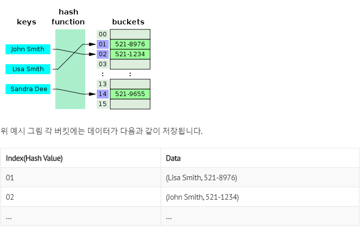
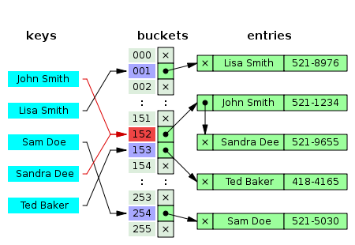
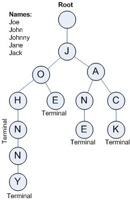

# Part 1-2 DataStructure

- [Array vs LinkedList](#array-vs-linkedlist)
- [Stack and Queue](#stack-and-queue)
- [Tree](#tree)
  - Binary Tree
  - Full Binary Tree
  - Complete Binary Tree
  - BST(Binary Search Tree)
- [Binary Heap](#binary-heap)
- [Red Black Tree](#red-black-tree)
  - 정의
  - 특징
  - 삽입
  - 삭제
- [HashTable](#hashtable)
  - hash function
  - Resolve Collision
    - Open Addressing
    - Separate Chaining
  - Resize
- [Graph](#graph)
  - Graph 용어정리
  - Graph 구현
  - Graph 탐색
  - Minimum Spanning Tree
    - Kruskal algorithm
    - Prim algorithm

[뒤로](https://github.com/pjok1122/Interview_Question_for_Beginner)

</br>

## Array vs LinkedList

### Array

가장 기본적인 자료구조인 `Array` 자료구조는, 논리적 저장 순서와 물리적 저장 순서가 일치합니다. 따라서 `인덱스`(index)로 해당 원소(element)에 접근할 수 있다. 그렇기 때문에 찾고자 하는 원소의 인덱스 값을 알고 있으면 `Big-O(1)`에 해당 원소로 접근할 수 있습니다. 즉 **random access** 가 가능하다는 장점이 있는 것입니다.

하지만 삭제 또는 삽입의 과정에서는 해당 원소에 접근하여 작업을 완료한 뒤(`O(1)`), 삭제한 원소보다 큰 인덱스를 갖는 원소들을 `shift`해줘야 하는 비용(cost)이 발생하고 이 경우 최악의 시간 복잡도는 O(n)가 됩니다.

### LinkedList

LinkedList의 각 노드는 자신과 연결된 노드의 주소와 값을 저장하고 있습니다. 따라서 삽입(삭제) 시에는 노드를 생성(삭제)하고 연결(연결해제)만 해주면 되기 때문에 시간복잡도는 `Big-O(1)`이 됩니다.

하지만 LinkedList 역시 한 가지 문제가 있습니다. LinkedList에는 인덱스가 존재하지 않기 때문에, Search의 시간복잡도는 `O(n)`입니다. 삽입과 삭제를 하기 위해서는 해당 노드를 Search 하는 연산이 추가적으로 발생하기 때문에 삽입과 삭제의 최종 시간복잡도는 `O(n)`이라고 할 수 있습니다.

결국 linked list 자료구조는 search 에도 O(n)의 time complexity 를 갖고, 삽입, 삭제에 대해서도 O(n)의 time complexity 를 갖게 됩니다. Linked List는 Tree 구조의 근간이 되는 자료구조이며, Tree 에서 사용되었을 때 진가를 발휘할 수 있습니다.

추가적으로 List의 장점을 꼽자면 Array는 생성과 동시에 크기를 지정해줘야 하지만, List는 배열의 크기가 동적으로 변할 수 있습니다.

#### Personal Recommendation

- [LinkedList 구현하기](./codes/LinkedList.py)
- [주어진 배열을 k 만큼 Shift 하는 알고리즘 만들기](./codes/Shift-k.py)
- sum(i\*arr[i])의 값이 최대가 되도록 만들기

[뒤로](https://github.com/pjok1122/Interview_Question_for_Beginner)/[위로](#part-1-2-datastructure)

---

</br>

## Stack and Queue

### Stack

선형 자료구조의 일종으로 `Last In First Out (LIFO)`. 즉, 나중에 들어간 원소가 먼저 나오는 특징이 있습니다. Stack의 사용 예시로는 `DFS(깊이 우선 탐색)`, `후위 연산`, `괄호 유효성 검사` 등이 있습니다.

### Queue

선형 자료구조의 일종으로 `First In First Out (FIFO)`. 즉, 들어온 원소 순서대로 나오는 특징이 있습니다. 참고로 Java Collection 에서 Queue 는 인터페이스입니다. 따라서 queue를 사용하려면, 이를 구현하고 있는 `Priority queue`등을 사용해야 합니다. queue의 사용 예시로는 `BFS(너비 우선 탐색)` 등이 있습니다.

#### Personal Recommendation

- [Stack을 Array, List, LinkedList로 구현하고 각각의 차이점 파악하기.](./codes/Stack.py)
- [Stack 을 사용하여 미로찾기 구현하기(DFS를 iterative 또는 recursive)](./codes/maze.py)
- [Queue를 Array, List, LinkedList로 구현하고 각각의 차이점 파악하기.](./codes/Queue.py)
- [Stack 두 개로 Queue 자료구조 구현하기](./codes/stack_to_queue.py)
- [Stack 으로 괄호 유효성 체크 코드 구현하기](./codes/괄호유효성.py)

[뒤로](https://github.com/pjok1122/Interview_Question_for_Beginner)/[위로](#part-1-2-datastructure)

---

</br>

## Tree

트리의 정의는 사이클이 없는 연결 그래프입니다.

사이클은 '경로'에서 한 노드가 두 번이상 포함되는 것을 의미합니다. 연결 그래프란 모든 노드들이 '연결' 되어있다는 뜻이며, '연결'되었다는 의미는 모든 노드 사이에 '경로'가 존재함을 의미합니다.

#### 트리를 구성하고 있는 구성요소들(용어)

- Node (노드) : 트리를 구성하고 있는 각각의 요소를 의미한다.
- Edge (간선) : 트리를 구성하기 위해 노드와 노드를 연결하는 선을 의미한다.
- Root Node (루트 노드) : 트리 구조에서 최상위에 있는 노드를 의미한다.
- Terminal Node ( = leaf Node, 단말 노드) : 하위에 다른 노드가 연결되어 있지 않은 노드를 의미한다.
- Internal Node (내부노드, 비단말 노드) : 단말 노드를 제외한 모든 노드로 루트 노드를 포함한다.

</br>

### Binary Tree (이진 트리)

루트 노드는 최대 두 개의 서브 트리를 가지며, 각각의 서브 트리 또한 모두 이진 트리이면 됩니다. 한 가지 덧붙이자면 공집합도 이진 트리로 포함합니다.

루트 노드를 정의했기 때문에, 루트 노드부터 각 노드는 자식노드를 최대 2개만 갖는 트리를 이진 트리로 정의하여도 큰 문제는 없어보입니다.

트리에서는 각 `층별로` 숫자를 매겨서 이를 트리의 `Level(레벨)`이라고 한다. 레벨의 값은 0 부터 시작하고 따라서 루트 노트의 레벨은 0 이다. 그리고 트리의 최고 레벨을 가리켜 해당 트리의 `height(높이)`라고 한다.

#### Full Binary Tree (포화 이진 트리), Complete Binary Tree (완전 이진 트리)

모든 레벨이 꽉 찬 이진 트리를 가리켜 포화 이진 트리라고 합니다.

각 레벨에서 왼쪽에서 오른쪽의 노드가 빈틈없이 채워져 있는 것을 완전 이진트리라고 합니다.

완전 이진트리는 배열로 구현하는 것이 가장 좋습니다. 그 이유를 보면,

노드의 개수가 n개 일 때, i 번째 노드에 대해서 parent(i) = i/2 , left_child(i) = 2i , right_child(i) = 2i + 1 의 index 값을 갖기 때문입니다.

</br>

### BST(Binary Search Tree)

`이진 탐색 트리`는 `이진 트리`의 일종이나 `Search`에 최적화된 트리입니다. `BST`는 다음과 같은 규칙들을 만족하도록 저장합니다.

- 규칙 1. 이진 탐색 트리의 노드에 저장된 키는 유일하다.
- 규칙 2. 루트 노드의 키 > 왼쪽 서브트리의 최댓값
- 규칙 3. 루트 노드의 키 < 오른쪽 서브트리의 최솟값
- 규칙 4. 왼쪽과 오른쪽 서브트리도 이진 탐색 트리이다.

`Search`에 대한 평균 시간복잡도는 `O(logn)` 가 됩니다. 하지만 최악의 경우, 편향 이진트리로 생성되었을 때 시간 복잡도는 `O(n)`이 될 수 있습니다.

`Insert` `Delete` 연산 또한 Search에 기반하기 때문에 시간복잡도는 동일하게 `O(logn)`이나 최악의 경우에는 `O(n)`이 됩니다.

이를 해결하기 위해 `Rebalancing` 기법이 등장하였습니다. `Rebalancing`은 트리의 높이를 조정하는 기법으로, 이를 구현한 트리는 여러 종류가 존재하지만 그 중에서 하나가 뒤에서 살펴볼 `AVL Tree`, `Red-Black Tree`입니다.

#### Personal Recommendation

- [Tree는 어떻게 구현하는 것이 좋을까? (인접행렬 vs 연결리스트)](./codes/Tree.py)
- [Binary Tree의 3가지 순회 방법 구현하기](./codes/트리의순회.py)
- [주어진 트리가 Binary 트리인지 확인하는 알고리즘 구현하기](./codes/check_binary.py)
- [Binary Search Tree 구현하기](./codes/BST.py)
- 주어진 트리가 Binary Search Tree인지 확인하는 알고리즘 구현하기

[뒤로](https://github.com/pjok1122/Interview_Question_for_Beginner)/[위로](#part-1-2-datastructure)

</br>

## Binary Heap

Heap이란 `Complete Binary Tree` 중 일부 조건을 만족하는 Tree 입니다. `힙(Heap)`에는 `최대힙(max heap)`, `최소힙(min heap)` 두 종류가 있습니다.

`Max Heap`이란, 각 노드의 값이 children 의 값보다 **크거나 같은** `complete binary tree`를 말합니다. 참고로 `Complete binary tree`는 배열로 구현하는 것이 좋습니다.

`Max heap`에서는 Root node 에 있는 값이 제일 크므로, 최대값을 찾는데 소요되는 연산의 time complexity 이 O(1)입니다. 그리고 `complete binary tree`이기 때문에 배열을 사용하여 효율적으로 관리할 수 있습니다. 삭제 연산이 일어날 경우, heap 은 맨 마지막 노드를 루트 노드로 대체시킨 후, heapify 과정을 거쳐 heap 구조를 유지합니다. 이러한 heapify 연산의 시간복잡도는 `O(logn)`이 됩니다. 삽입 연산의 경우에도, 최대 트리의 높이만큼의 연산이 발생하므로 시간 복잡도는 `O(logn)`이 됩니다.

힙은 Max 또는 Min 값을 찾는 데에 특화되어있으며, 힙이 갖는 의미는 `우선순위 큐`와 동일합니다.
_ref) Heap Sort는 Heap 자료구조에서 pop 연산을 노드의 개수만큼 호출한 정렬입니다._

#### Personal Recommendation

- [Max-heap 구현하기 (heapify 포함)](./codes/max_heap.py)

[뒤로](https://github.com/pjok1122/Interview_Question_for_Beginner)/[위로](#part-1-2-datastructure)

</br>

## Red Black Tree

RBT(Red-Black Tree)는 BST인데, 트리의 높이를 항상 logn 으로 유지합니다. 따라서 RBT에 데이터를 삽입, 삭제, 검색 하는 데에 걸리는 시간 복잡도는 항상 O(logn)이 됩니다. depth가 최소가 되는 경우는 tree가 complete binary tree인 경우와 같습니다.

RBT(Red-Black Tree)는 BST 를 기반으로하는 트리 형식의 자료구조이다. 결론부터 말하자면 Red-Black Tree 에 데이터를 저장하게되면 Search, Insert, Delete 에 O(log n)의 시간 복잡도가 소요된다. 동일한 노드의 개수일 때, depth 를 최소화하여 시간 복잡도를 줄이는 것이 핵심 아이디어이다. 동일한 노드의 개수일 때, depth 가 최소가 되는 경우는 tree 가 complete binary tree 인 경우이다.

### Red-Black Tree 의 정의

Red-Black Tree 는 다음의 성질들을 만족하는 BST 입니다.

1.  각 노드는 `Red` or `Black`이라는 색깔을 갖는다.
2.  Root node 의 색깔은 `Black`이다.
3.  각 leaf node 는 `black`이다. (NIL 노드가 Black 입니다.)
4.  어떤 노드의 색깔이 `red`라면 두 개의 children 의 색깔은 모두 black 이다.
5.  각 노드에 대해서 노드로부터 descendant leaves 까지의 단순 경로는 모두 같은 수의 black nodes 들을 포함하고 있다. 이를 해당 노드의 `Black-Height`라고 한다.  
    _cf) Black-Height: 노드 x 로부터 노드 x 를 포함하지 않은 leaf node 까지의 simple path 상에 있는 black nodes 들의 개수_

### Red-Black Tree 의 특징

1.  Binary Search Tree 이므로 BST 의 특징을 모두 갖는다.
2.  Root node 부터 leaf node 까지의 모든 경로 중 최소 경로와 최대 경로의 크기 비율은 2 보다 크지 않다. 이러한 상태를 `balanced` 상태라고 한다.
3.  노드의 child 가 없을 경우 child 를 가리키는 포인터는 NIL 값을 저장한다. 이러한 NIL 들을 leaf node 로 간주한다.

_RBT 는 BST 의 삽입, 삭제 연산 과정에서 발생할 수 있는 문제점을 해결하기 위해 만들어진 자료구조이다. 이를 어떻게 해결한 것인가?_

</br>

### 삽입

우선 BST 의 특성을 유지하면서 노드를 삽입을 한다. 그리고 삽입된 노드의 색깔을 **RED 로** 지정한다. Red 로 지정하는 이유는 Black-Height 변경을 최소화하기 위함이다. 삽입 결과 RBT 의 특성 위배(violation)시 노드의 색깔을 조정하고, Black-Height 가 위배되었다면 rotation 을 통해 height 를 조정한다. 이러한 과정을 통해 RBT 의 동일한 height 에 존재하는 internal node 들의 Black-height 가 같아지게 되고 최소 경로와 최대 경로의 크기 비율이 2 미만으로 유지된다.

### 삭제

삭제도 삽입과 마찬가지로 BST 의 특성을 유지하면서 해당 노드를 삭제한다. 삭제될 노드의 child 의 개수에 따라 rotation 방법이 달라지게 된다. 그리고 만약 지워진 노드의 색깔이 Black 이라면 Black-Height 가 1 감소한 경로에 black node 가 1 개 추가되도록 rotation 하고 노드의 색깔을 조정한다. 지워진 노드의 색깔이 red 라면 Violation 이 발생하지 않으므로 RBT 가 그대로 유지된다.

Java Collection 에서 ArrayList 도 내부적으로 RBT 로 이루어져 있고, HashMap 에서의 `Separate Chaining`에서도 사용된다. 그만큼 효율이 좋고 중요한 자료구조이다.

[뒤로](https://github.com/pjok1122/Interview_Question_for_Beginner)/[위로](#part-1-2-datastructure)

---

</br>

## HashTable



[사진 출처](https://ratsgo.github.io/data%20structure&algorithm/2017/10/25/hash/)

`hash`는 내부적으로 `배열`을 사용하여 데이터를 저장하기 때문에 빠른 검색 속도를 갖는다. 특정한 값을 Search 하는데 데이터 고유의 `인덱스`로 접근하게 되므로 average case 에 대하여 Time Complexity 가 O(1)이 된다.

</br>

### hash function

임의의 길이의 데이터를 고정된 길이의 데이터로 매핑하는 함수이다. 일반적으로 도메인이 공역보다 크기 때문에 비둘기집의 원리에 의해 반드시 충돌쌍이 발생할 수 있다. 이러한 충돌쌍이 언제 발생하는지 유추할 수 없도록 함수를 잘 설계하는 것이 무엇보다 중요하다.

`Collision` 이 많아질 수록 Search 에 필요한 Time Complexity 가 O(1)에서 O(n)에 가까워진다. 어설픈 `hash function`는 hash 를 hash 답게 사용하지 못하도록 한다. 좋은 `hash function`를 선택하는 것은 hash table 의 성능 향상에 필수적인 것이다.

따라서 hashing 된 인덱스에 이미 다른 값이 들어 있다면 세 데이터를 저장할 다른 위치를 찾은 뒤에야 저장할 수 있는 것이다. 따라서 충돌 해결은 필수이며 그 방법들에 대해 알아보자.

</br>

### Resolve Conflict

기본적인 두 가지 방법부터 알아보자. 해시 충돌을 해결하기 위한 다양한 자료가 있지만, 다음 두 가지 방법을 응용한 방법들이기 때문이다.

#### 1. Open Address 방식 (개방주소법)

해시 충돌이 발생하면, (즉 삽입하려는 해시 버킷이 이미 사용 중인 경우) **다른 해시 버킷에 해당 자료를 삽입하는 방식** 이다. 버킷이란 바구니와 같은 개념으로 데이터를 저장하기 위한 공간이라고 생각하면 된다. 다른 해시 버킷이란 어떤 해시 버킷을 말하는 것인가?

공개 주소 방식이라고도 불리는 이 알고리즘은 Collision 이 발생하면 데이터를 저장할 장소를 찾아 헤맨다. Worst Case 의 경우 비어있는 버킷을 찾지 못하고 탐색을 시작한 위치까지 되돌아 올 수 있다. 이 과정에서도 여러 방법들이 존재하는데, 다음 세 가지에 대해 알아보자.

1.  Linear Probing  
    충돌 발생 시 +1씩 늘려가며 빈 버킷을 찾는다.
2.  Quadratic probing  
    충돌 발생 시 +1, +4, +9 씩 늘려가며 빈 버킷을 찾는다.
3.  Double hashing probing  
    충돌 발생 시, 또 다른 해시함수를 가지고 몇 칸 이동해서 빈 버킷을 찾을지 결정한다.

</br>

#### 2. Separate Chaining 방식 (분리 연결법)



일반적으로 Open Addressing 은 Separate Chaining 보다 느리다. Open Addressing 의 경우 해시 버킷을 채운 밀도가 높아질수록 Worst Case 발생 빈도가 더 높아지기 때문이다. Java 7 에서는 Separate Chaining 방식을 사용하여 HashMap 을 구현하고 있다. Separate Chaining 방식으로는 두 가지 구현 방식이 존재한다.

- **연결 리스트를 사용하는 방식(Linked List)**  
  각각의 버킷(bucket)들을 연결리스트(Linked List)로 만들어 Collision 이 발생하면 해당 bucket 의 list 에 추가하는 방식이다. 연결 리스트의 특징을 그대로 이어받아 삭제 또는 삽입이 간단하다. 하지만 단점도 그대로 물려받아 작은 데이터들을 저장할 때 연결 리스트 자체의 오버헤드가 부담이 된다. 또 다른 특징으로는, 버킷을 계속해서 사용하는 Open Address 방식에 비해 테이블의 확장을 늦출 수 있다.

- **Tree 를 사용하는 방식 (Red-Black Tree)**  
  기본적인 알고리즘은 Separate Chaining 방식과 동일하며 연결 리스트 대신 트리를 사용하는 방식이다. 연결 리스트를 사용할 것인가와 트리를 사용할 것인가에 대한 기준은 하나의 해시 버킷에 할당된 key-value 쌍의 개수이다. 데이터의 개수가 적다면 링크드 리스트를 사용하는 것이 맞다. 트리는 기본적으로 메모리 사용량이 많기 때문이다. 데이터 개수가 적을 때 Worst Case 를 살펴보면 트리와 링크드 리스트의 성능 상 차이가 거의 없다. 따라서 메모리 측면을 봤을 때 데이터 개수가 적을 때는 링크드 리스트를 사용한다.

**_데이터가 적다는 것은 얼마나 적다는 것을 의미하는가?_**  
앞에서 말했듯이 기준은 하나의 해시 버킷에 할당된 key-value 쌍의 개수이다. 이 키-값 쌍의 개수가 6 개, 8 개를 기준으로 결정한다. 기준이 두 개 인것이 이상하게 느껴질 수 있다. 7 은 어디로 갔는가? 링크드 리스트의 기준과 트리의 기준을 6 과 8 로 잡은 것은 변경하는데 소요되는 비용을 줄이기 위함이다.

**_한 가지 상황을 가정해보자._**  
해시 버킷에 **6 개** 의 key-value 쌍이 들어있었다. 그리고 하나의 값이 추가되었다. 만약 기준이 6 과 7 이라면 자료구조를 링크드 리스트에서 트리로 변경해야 한다. 그러다 바로 하나의 값이 삭제된다면 다시 트리에서 링크드 리스트로 자료구조를 변경해야 한다. 각각 자료구조로 넘어가는 기준이 1 이라면 Switching 비용이 너무 많이 필요하게 되는 것이다. 그래서 2 라는 여유를 남겨두고 기준을 잡아준 것이다. 따라서 데이터의 개수가 6 개에서 7 개로 증가했을 때는 링크드 리스트의 자료구조를 취하고 있을 것이고 8 개에서 7 개로 감소했을 때는 트리의 자료구조를 취하고 있을 것이다.

#### `Open Address` vs `Separate Chaining`

일단 두 방식 모두 Worst Case 에서 O(N)이다. 하지만 `Open Address`방식은 연속된 공간에 데이터를 저장하기 때문에 `Separate Chaining`에 비해 캐시 효율이 높다. 따라서 데이터의 개수가 충분히 적다면 `Open Address`방식이 `Separate Chaining`보다 더 성능이 좋다. 한 가지 차이점이 더 존재한다. `Separate Chaining`방식에 비해 `Open Address`방식은 버킷을 계속해서 사용한다. 따라서 `Separate Chaining` 방식은 테이블의 확장을 보다 늦출 수 있다.

#### 보조 해시 함수

보조 해시 함수(supplement hash function)의 목적은 `key`의 해시 값을 변형하여 해시 충돌 가능성을 줄이는 것이다. `Separate Chaining` 방식을 사용할 때 함께 사용되며 보조 해시 함수로 Worst Case 에 가까워지는 경우를 줄일 수 있다.

</br>

### 해시 버킷 동적 확장(Resize)

해시 버킷의 개수가 적다면 메모리 사용을 아낄 수 있지만 해시 충돌로 인해 성능 상 손실이 발생한다. 그래서 HashMap 은 key-value 쌍 데이터 개수가 일정 개수 이상이 되면 해시 버킷의 개수를 두 배로 늘린다. 이렇게 늘리면 해시 충돌로 인한 성능 손실 문제를 어느 정도 해결할 수 있다. 또 애매모호한 '일정 개수 이상'이라는 표현이 등장했다. 해시 버킷 크기를 두 배로 확장하는 임계점은 현재 데이터 개수가 해시 버킷의 개수의 75%가 될 때이다. `0.75`라는 숫자는 load factor 라고 불린다.

##### Reference

- http://d2.naver.com/helloworld/831311

## [뒤로](https://github.com/pjok1122/Interview_Question_for_Beginner)/[위로](#part-1-2-datastructure)

</br>

## 트라이(Trie)

> 문자열 검색을 빠르게 도와주는 자료구조



문자열의 길이가 M인 문자열에 대해서 이진탐색을 진행하면 시간 복잡도는 `O(MlogN)`이 됩니다. 하지만 `Trie`를 이용하는 경우에는 시간 복잡도를 `O(M)`으로 낮출 수 있습니다.

#### Personal Recommendation

- [Trie 구현하기](./codes/Trie.py)

</br>

[뒤로](https://github.com/pjok1122/Interview_Question_for_Beginner)/[위로](#part-1-2-datastructure)

</br>

## Graph

### 정점과 간선의 집합, Graph

_cf) 트리 또한 그래프이며, 그 중 사이클이 허용되지 않는 그래프를 말한다._

### 그래프 관련 용어 정리

#### Undirected Graph 와 Directed Graph(Digraph)

말 그대로 정점과 간선의 연결관계에 있어서 방향성이 없는 그래프를 Undirected Graph 라 하고,
간선에 방향성이 포함되어 있는 그래프를 Directed Graph 라고 한다.

- Directed Graph(Digraph)

```
V = {1, 2, 3, 4, 5, 6}
E = {(1, 4), (2,1), (3, 4), (3, 4), (5, 6)}
(u, v) = vertex u에서 vertex v로 가는 edge
```

- Undirected Graph

```
V = {1, 2, 3, 4, 5, 6}
E = {(1, 4), (2,1), (3, 4), (3, 4), (5, 6)}
(u, v) = vertex u와 vertex v를 연결하는 edge
```

#### Degree

Undirected Graph 에서 각 정점(Vertex)에 연결된 Edge 의 개수를 Degree 라 한다.
Directed Graph 에서는 간선에 방향성이 존재하기 때문에 Degree 가 두 개로 나뉘게 된다.
각 정점으로부터 나가는 간선의 개수를 Outdegree 라 하고, 들어오는 간선의 개수를 Indegree 라 한다.

#### 가중치 그래프(Weight Graph)와 부분 그래프(Sub Graph)

가중치 그래프란 간선에 가중치 정보를 두어서 구성한 그래프를 말한다. 반대의 개념인 비가중치 그래프 즉, 모든 간선의 가중치가 동일한 그래프도 물론 존재한다. 부분 집합과 유사한 개념으로 부분 그래프라는 것이 있다. 부분 그래프는 본래의 그래프의 일부 정점 및 간선으로 이루어진 그래프를 말한다.

</br>

### 그래프를 구현하는 두 방법

#### 인접 행렬(adjacent matrix) : 정방 행렬을 사용하는 방법

해당하는 위치의 value 값을 통해서 vertex 간의 연결 관계를 O(1) 으로 파악할 수 있다. Edge 개수와는 무관하게 V^2 의 Space Complexity 를 갖는다. Dense graph 를 표현할 때 적절할 방법이다.

#### 인접 리스트(adjacent list) : 연결 리스트를 사용하는 방법

vertex 의 adjacent list 를 확인해봐야 하므로 vertex 간 연결되어있는지 확인하는데 오래 걸린다. Space Complexity 는 O(E + V)이다. Sparse graph 를 표현하는데 적당한 방법이다.

</br>

### 그래프 탐색

그래프는 정점의 구성 뿐만 아니라 간선의 연결에도 규칙이 존재하지 않기 때문에 탐색이 복잡하다. 따라서 그래프의 모든 정점을 탐색하기 위한 방법은 다음의 두 가지 알고리즘을 기반으로 한다.

#### 깊이 우선 탐색(Depth First Search: DFS)

그래프 상에 존재하는 임의의 한 정점으로부터 연결되어 있는 한 정점으로만 나아간다라는 방법을 우선으로 탐색한다. 일단 연결된 정점으로 탐색하는 것이다. 연결할 수 있는 정점이 있을 때까지 계속 연결하다가 더이상 연결되지 않은 정점이 없으면 바로 그 전 단계의 정점으로 돌아가서 연결할 수 있는 정점이 있는지 살펴봐야 할 것이다. 갔던 길을 되돌아 오는 상황이 존재하는 미로찾기처럼 구성하면 되는 것이다. 어떤 자료구조를 사용해야할까? 바로 Stack 이다.
**Time Complexity : O(V+E) … vertex 개수 + edge 개수**

#### 너비 우선 탐색(Breadth First Search: BFS)

그래프 상에 존재하는 임의의 한 정점으로부터 연결되어 있는 모든 정점으로 나아간다. Tree 에서의 Level Order Traversal 형식으로 진행되는 것이다. BFS 에서는 자료구조로 Queue 를 사용한다. 연락을 취할 정점의 순서를 기록하기 위한 것이다.
우선, 탐색을 시작하는 정점을 Queue 에 넣는다.(enqueue) 그리고 dequeue 를 하면서 dequeue 하는 정점과 간선으로 연결되어 있는 정점들을 enqueue 한다.
즉 vertex 들을 방문한 순서대로 queue 에 저장하는 방법을 사용하는 것이다.
**Time Complexity : O(V+E) … vertex 개수 + edge 개수**
_**! BFS 로 구한 경로는 최단 경로이다.**_

</br>

### Minimum Spanning Tree

그래프 G 의 spanning tree 중 edge weight 의 합이 최소인 `spanning tree`를 말한다. 여기서 말하는 `spanning tree`란 그래프 G 의 모든 vertex 가 cycle 이 없이 연결된 형태를 말한다.

### Kruskal Algorithm

초기화 작업으로 **edge 없이** vertex 들만으로 그래프를 구성한다. 그리고 weight 가 제일 작은 edge 부터 검토한다. 그러기 위해선 Edge Set 을 non-decreasing 으로 sorting 해야 한다. 그리고 가장 작은 weight 에 해당하는 edge 를 추가하는데 추가할 때 그래프에 cycle 이 생기지 않는 경우에만 추가한다. spanning tree 가 완성되면 모든 vertex 들이 연결된 상태로 종료가 되고 완성될 수 없는 그래프에 대해서는 모든 edge 에 대해 판단이 이루어지면 종료된다.

#### 어떻게 cycle 생성 여부를 판단하는가?

Graph 의 각 vertex 에 `set-id`라는 것을 추가적으로 부여한다. 그리고 초기화 과정에서 모두 1~n 까지의 값으로 각각의 vertex 들을 초기화 한다. 여기서 0 은 어떠한 edge 와도 연결되지 않았음을 의미하게 된다. 그리고 연결할 때마다 `set-id`를 하나로 통일시키는데, 값이 동일한 `set-id` 개수가 많은 `set-id` 값으로 통일시킨다.

#### Time Complexity

1.  Edge 의 weight 를 기준으로 sorting - O(E log E)
2.  cycle 생성 여부를 검사하고 set-id 를 통일 - O(E + V log V)
    => 전체 시간 복잡도 : O(E log E)

### Prim Algorithm

초기화 과정에서 한 개의 vertex 로 이루어진 초기 그래프 A 를 구성한다. 그리고나서 그래프 A 내부에 있는 vertex 로부터 외부에 있는 vertex 사이의 edge 를 연결하는데 그 중 가장 작은 weight 의 edge 를 통해 연결되는 vertex 를 추가한다. 어떤 vertex 건 간에 상관없이 edge 의 weight 를 기준으로 연결하는 것이다. 이렇게 연결된 vertex 는 그래프 A 에 포함된다. 위 과정을 반복하고 모든 vertex 들이 연결되면 종료한다.

#### Time Complexity

=> 전체 시간 복잡도 : O(E log V)

</br>

_DataStructure.end_  
[뒤로](https://github.com/JaeYeopHan/for_beginner)/[위로](#part-1-2-datastructure)
