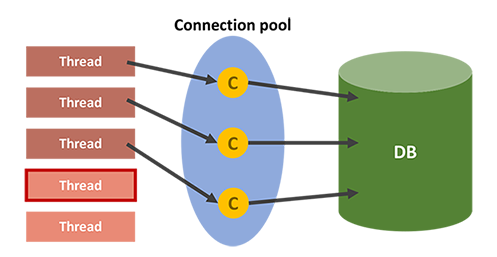

# Part 1-5 Database

- [데이터베이스](#데이터베이스)
  - 데이터베이스를 사용하는 이유
  - 데이터베이스 성능
  - 데이터베이스 풀
- [SQL Join](#sql-join)
  - Inner Join
  - Outer Join
- [SQL Injection](#sql-injection)
  - 공격 방법
  - 방어 방법
- [정규화](#정규화)
  - 이상현상(Anomaly)
  - 1NF ~ BCNF
  - 반정규화
- [Index](#index)
  - Index 란 무엇인가
  - Index 의 자료구조
  - Primary index vs Secondary index
  - Composite index
  - Index 의 성능과 고려해야할 사항
- [Transaction](#transaction)
  - 트랜잭션(Transaction)이란 무엇인가?
  - 트랜잭션의 특성
  - 트랜잭션의 상태도
  - 트랜잭션을 사용할 때 주의할 점
- [교착상태](#교착상태)
  - 교착상태란 무엇인가
  - 교착상태의 예(MySQL)
  - 교착 상태의 빈도를 낮추는 방법
  - Isolation level
- [Statement vs PrepareStatement](#statement-vs-preparestatement)
- [SQL vs No-SQL](#sql-vs-no-sql)
  - SQL의 특성과 장단점
  - No-SQL의 특성과 장단점
- [NoSQL](#nosql)
  - 정의
  - CAP 이론
    - 일관성
    - 가용성
    - 네트워크 분할 허용성
  - 저장방식에 따른 분류
    - Key-Value Model
    - Document Model
    - Column Model

[뒤로](https://github.com/pjok1122/Interview_Question_for_Beginner)

</br>

## 데이터베이스

### 데이터베이스를 사용하는 이유

데이터베이스가 존재하기 이전에는 파일 시스템을 이용하여 데이터를 관리하였다. 파일 시스템은 데이터를 각각의 파일 단위로 저장하며 이러한 일들을 처리하기 위한 독립적인 애플리케이션과 상호 연동이 되어야 한다. 이 때의 문제점은 데이터의 중복, 일관성, 무결성 등이 있다.

#### 데이터베이스의 특징

1.  데이터의 독립성
    - 물리적 독립성 : 데이터베이스 사이즈를 늘리거나 성능 향상을 위해 데이터 파일을 늘리거나 새롭게 추가하더라도 관련된 응용 프로그램을 수정할 필요가 없다.
    - 논리적 독립성 : 데이터베이스는 논리적인 구조로 다양항 응용 프로그램의 논리적 요구를 만족시켜줄 수 있다.
2.  데이터의 무결성  
    여러 경로를 통해 잘못된 데이터가 발생하는 경우의 수를 방지하는 기능으로 데이터의 유효성 검사를 통해 데이터의 무결성을 구현하게 된다.
3.  데이터의 보안성  
    인가된 사용자들만 데이터베이스나 데이터베이스 내의 자원에 접근할 수 있도록 계정 관리 또는 **접근 권한을 설정함으로써 모든 데이터에 보안을 구현**할 수 있다.
4.  데이터의 일관성  
    **연관된 정보를 논리적은 구조로 관리함으로써 어떤 하나의 데이터만 변경했을 경우 발생할 수 있는 데이터의 불일치성을 배제할 수 있다.** 또한 작업 중 일부 데이터만 변경되어 나머지 데이터와 일치하지 않는 경우의 수를 배제할 수 있다.
5.  데이터 중복 최소화  
    데이터베이스는 데이터를 통합해서 관리함으로써 파일 시스템의 단점 중 하나인 자료의 중복과 데이터의 중복성 문제를 해결할 수 있다.

</br>

### 데이터베이스의 성능?

데이터베이스의 성능 이슈는 디스크 I/O 를 어떻게 줄이느냐에서 시작된다. 디스크 I/O 란 디스크 드라이브의 플래터(원판)을 돌려서 읽어야 할 데이터가 저장된 위치로 디스크 헤더를 이동시킨 다음 데이터를 읽는 것을 의미한다. 이 때 데이터를 읽는데 걸리는 시간은 디스크 헤더를 움직여서 읽고 쓸 위치로 옮기는 단계에서 결정된다. 즉 디스크의 성능은 디스크 헤더의 위치 이동 없이 얼마나 많은 데이터를 한 번에 기록하느냐에 따라 결정된다고 볼 수 있다.

그렇기 때문에 순차 I/O 가 랜덤 I/O 보다 빠를 수 밖에 없다. 하지만 현실에서는 대부분의 I/O 작업이 랜덤 I/O 이다. 랜덤 I/O 를 순차 I/O 로 바꿔서 실행할 수는 없을까? 이러한 생각에서부터 시작되는 **데이터베이스 쿼리 튜닝은 랜덤 I/O 자체를 줄여주는 것이 목적이라고 할 수 있다.**

</br>

### 데이터베이스 풀



#### Connection Pool

클라이언트의 요청에 따라 각 어플리케이션의 쓰레드에서 데이터베이스에 접근하기 위해서는 Connection이 필요하다. DB에 접근 요청이 필요할 때마다 Connection을 생성하는 것 보다는 미리 Connection을 만들어놓고 사용하는 것이 좋다. 따라서 Connection pool에 Connection을 만들어놓고, Thread는 DB 접근이 필요할 때마다 Connection pool에서 Connection을 얻어와 DB에 접근한 후, Connection을 반납한다.

[뒤로](https://github.com/pjok1122/Interview_Question_for_Beginner)/[위로](#part-1-5-database)

</br>

## SQL Join

Join이란 두 개 이상의 테이블을 연결하여 데이터를 검색하는 기법이다.

#### Inner Join

내부 조인은 A와 B를 조인할 때, A와 B의 공통된 부분만을 보여준다. 즉, 교집합 연산과 동일하다.

```sql
SELECT A.name, B.age
FROM A
INNER JOIN B ON A.no = B.no
```

#### Outer Join

외부 조인은 A와 B를 조인할 때, 어떤 테이블을 기준으로 조인할 지를 선택할 수 있다. A를 기준으로 조인하는 경우 `Left outer join`이 되며 A에 B와 일치하는 컬럼 값이 없어도, NULL로 셋팅하여 조인한다. 마찬가지로 `Right outer join`이 존재하고, left와 outer를 합친 `Full outer join`도 존재한다.

```sql
SELECT A.name, B.age
FROM A
LEFT OUTER JOIN B ON A.no = B.no
```

그 외에 `Cross join`, `Self join` 과 같은 특수한 join 들도 존재한다.

[뒤로](https://github.com/pjok1122/Interview_Question_for_Beginner)/[위로](#part-1-5-database)

</br>

## SQL Injection

SQL Injection은 해커에 의해 조작된 SQL 쿼리문이 Database에 그대로 전달되어 손상을 입히거나 정보를 탈취하는 공격을 말한다.

#### 인증 우회

로그인 창에 아이디("abcd")와 패스워드("1234")를 넣으면 다음과 같은 SQL문이 실행될 것으로 추측할 수 있다.

```sql
SELECT *
FROM USER
WHERE id="abcd" AND passwd ="1234"
```

따라서 패스워드 자리에, `"1234 OR '1'='1'` 과 같은 진릿값이 True인 결과를 삽입하면 틀린 패스워드 임에도 로그인이 가능하다.

다중 SQL문을 지원하는 경우에는 패스워드 자리에 `;DELETE * FROM USER;` 를 통해서 데이터를 삭제하는 것도 가능하다.

#### 데이터 노출

시스템에서 발생하는 에러 메시지를 이용해 공격하는 방법이다. **GET 방식으로 동작하는 URL 쿼리 스트링을 추가하여 에러를 발생**시키고 오류를 통해 데이터베이스의 구조를 파악할 수 있다.

### 방어 방법

#### preparestatement 사용하기

preparestatement를 사용하면 특수문자를 자동으로 escaping 해준다. (statement와 다르게 쿼리문에서 전달인자 값을 ?로 받는 것) 이를 활용하면 서버 측에서 필터링 과정을 통해서 공격을 방해한다.

#### SQL 서버 오류 발생 시, 오류 메시지 감추기

view를 활용하여 원본 데이터베이스 테이블에는 접근 권한을 높인다. 일반 사용자는 view로만 접근하여 에러를 볼 수 없도록 만든다.

#### 다중 SQL 지원 기능 끄기

한 번의 SQL문에는 하나의 명령만이 사용가능하도록 설정하는 것도 방어 방법 중 하나이다.

[뒤로](https://github.com/pjok1122/Interview_Question_for_Beginner)/[위로](#part-1-5-database)

</br>

## 정규화

정규화는 데이터를 잘못 설계했을 때 발생하는 `이상현상(Anomaly)`을 제거하기 위해 진행한다.

### 이상현상(Anomaly)

예시 스키마) {student_id, course_id, major}

#### 1) 삽입이상

해당 테이블의 기본 키는 {student_id,course_id} 가 된다. 하지만 학생이 어느 수업도 수강하지 않을 수 있는데, 기본키에는 NULL을 삽입할 수 없으므로 이 테이블의 경우에는 수강신청을 하지 않는 학생의 정보를 삽입할 수가 없다.

굳이 삽입하기 위해서는 별도의 컬럼을 만들어야 하는 삽입 이상이 발생.

#### 2) 갱신이상

만약 학생의 전공(major)이 변경되었다면, 다른 테이블에서도 해당 학생의 major를 전부 변경해주어야 한다. 만약 실수로 누락하여 변경하지 못한 경우, 데이터의 불일치가 발생할 수 있다. 이를 갱신이상이라고 한다.

#### 3) 삭제이상

한 학생이 수강을 취소한 경우, 학생의 정보(학번, 과)까지 전부 삭제되는 문제가 발생할 수 있다. 튜플 삭제로 인해, 필요한 데이터가 함께 삭제되는 것을 삭제이상이라고 한다.

</br>

### 정규화 단계

#### 제 1정규화

속성의 각 도메인 값은 반드시 `원자값` 만을 포함해야 한다.

**제 1정규화 대상 :** course_id ={2080112, 2043142, 2043143}

#### 제 2정규화

모든 `부분 함수적 종속`을 제거하여 `완전 함수적 종속`으로 만드는 단계이다. 부분 함수적 종속은 기본키의 일부만을 가지고 나머지 속성을 결정하는 것을 말하며, 완전 함수적 종속은 기본키 전체를 사용하여 나머지 속성을 결정하는 것을 말한다.

**제 2정규화 대상 :** {**student_id**, **course_id**, major, grade, tuition_fee}

기본키 : {student_id, course_id}

부분 함수적 종속 : student_id --> major
완전 함수적 종속 : { student_id, course_id} --> grade

**제 2정규화:** {**student_id**, **course_id**, grade}, {**student_id**, major,tuition_fee}

#### 제 3정규화

`이행적 함수 종속`을 제거하는 단계이다. `이행적 함수 종속`이란 `X->Y, Y->Z`로 부터 `X->Z`를 결정해내는 것을 의미한다.

**제 3정규화 대상 :** {**student_id**, major, tuition_fee}

이행적 함수 종속 : student_id --> major --> tuition_fee(등록금)

**제 3정규화:** {**student_id**, major}, {**major**, tuition_fee}

#### BCNF(Boyce-Codd) 정규화

모든 `결정자`는 `후보키`여야 한다. `결정자`란 함수적 종속 관계에서 `비종속` 관계에 있는 속성을 의미한다. (X->Y 라면, X는 결정자이다.)

### 반정규화

Join이 빈번하게 발생하여 응답시간이 느려질 경우, 자주 사용되는 Join을 반정규화 해두는 것도 하나의 전략이 될 수 있다. 일반적으로 조회에 대한 성능이 중요하다고 판단될 때 수행한다.

</br>

[뒤로](https://github.com/pjok1122/Interview_Question_for_Beginner)/[위로](#part-1-5-database)

## Index

### 인덱스(Index)란 무엇인가?

인덱스는 말 그대로 책의 맨 처음 또는 맨 마지막에 있는 색인이라고 할 수 있다. 이 비유를 그대로 가져와서 인덱스를 살펴본다면 데이터는 책의 내용이고 데이터가 저장된 레코드의 주소는 인덱스 목록에 있는 페이지 번호가 될 것이다. DBMS 도 데이터베이스 테이블의 모든 데이터를 검색해서 원하는 결과를 가져 오려면 시간이 오래 걸린다. 그래서 **칼럼의 값과 해당 레코드가 저장된 주소를 키와 값의 쌍으로 인덱스를 만들어 두는 것이다.**

**DBMS 의 인덱스는 항상 정렬된 상태를 유지하기 때문에 원하는 값을 탐색하는데는 빠르지만 새로운 값을 추가하거나 삭제, 수정하는 경우에는 쿼리문 실행 속도가 느려진다.** 결론적으로 DBMS 에서 인덱스는 데이터의 저장 성능을 희생하고 그 대신 데이터의 읽기 속도를 높이는 기능이다. SELECT 쿼리 문장의 WHERE 조건절에 사용되는 칼럼이라고 전부 인덱스로 생성하면 데이터 저장 성능이 떨어지고 인덱스의 크기가 비대해져서 오히려 역효과만 불러올 수 있다.

</br>

### Index 자료구조

그렇다면 DBMS 는 인덱스를 어떻게 관리하고 있는가

#### B+-Tree 인덱스 알고리즘

일반적으로 사용되는 인덱스 알고리즘은 B+-Tree 알고리즘이다. B+-Tree 인덱스는 칼럼의 값을 변형하지 않고(사실 값의 앞부분만 잘라서 관리한다.), 원래의 값을 이용해 인덱싱하는 알고리즘이다.

#### Hash 인덱스 알고리즘

칼럼의 값으로 해시 값을 계산해서 인덱싱하는 알고리즘으로 매우 빠른 검색을 지원한다. 하지만 값을 변형해서 인덱싱하므로, 특정 문자로 시작하는 값으로 검색을 하는 등 전방 일치와 같이 값의 일부만으로 검색하고자 할 때는 해시 인덱스를 사용할 수 없다. 주로 메모리 기반의 데이터베이스에서 많이 사용한다.

#### 왜 index 를 생성하는데 b-tree 를 사용하는가?

데이터에 접근하는 시간복잡도가 O(1)인 hash table 이 더 효율적일 것 같은데? SELECT 질의의 조건에는 부등호(<>) 연산도 포함이 된다. hash table 을 사용하게 된다면 등호(=) 연산이 아닌 부등호 연산의 경우에 문제가 발생한다. 동등 연산(=)에 특화된 `hashtable`은 데이터베이스의 자료구조로 적합하지 않다.

</br>

### Primary Index vs Secondary Index

클러스터(Cluster)란 여러 개를 하나로 묶는다는 의미로 주로 사용되는데, 클러스터드 인덱스도 크게 다르지 않다. **인덱스에서 클러스터드는 비슷한 것들을 묶어서 저장하는 형태로 구현되는데, 이는 주로 비슷한 값들을 동시에 조회하는 경우가 많다는 점에서 착안된 것이다.** 여기서 비슷한 값들은 물리적으로 인접한 장소에 저장되어 있는 데이터들을 말한다.

클러스터드 인덱스는 테이블의 프라이머리 키에 대해서만 적용되는 내용이다. 즉 프라이머리 키 값이 비슷한 레코드끼리 묶어서 저장하는 것을 클러스터드 인덱스라고 표현한다. **클러스터드 인덱스에서는 프라이머리 키 값에 의해 레코드의 저장 위치가 결정되며 프라이머리 키 값이 변경되면 그 레코드의 물리적인 저장 위치 또한 변경되어야 한다.** 그렇기 때문에 프라이머리 키를 신중하게 결정하고 클러스터드 인덱스를 사용해야 한다.

클러스터드 인덱스는 테이블 당 한 개만 생성할 수 있다. 프라이머리 키에 대해서만 적용되기 때문이다, 이에 반해 non 클러스터드 인덱스는 테이블 당 여러 개를 생성할 수 있다.

</br>

### Composite Index

인덱스로 설정하는 필드의 속성이 중요하다. title, author 이 순서로 인덱스를 설정한다면 title 을 search 하는 경우, index 를 생성한 효과를 볼 수 있지만, author 만으로 search 하는 경우, index 를 생성한 것이 소용이 없어진다. 따라서 SELECT 질의를 어떻게 할 것인가가 인덱스를 어떻게 생성할 것인가에 대해 많은 영향을 끼치게 된다.

</br>

### Index 의 성능과 고려해야할 사항

SELECT 쿼리의 성능을 월등히 향상시키는 INDEX 항상 좋은 것일까? 쿼리문의 성능을 향상시킨다는데, 모든 컬럼에 INDEX 를 생성해두면 빨라지지 않을까?  
_결론부터 말하자면 그렇지 않다._  
우선, 첫번째 이유는 INDEX 를 생성하게 되면 INSERT, DELETE, UPDATE 쿼리문을 실행할 때 별도의 과정이 추가적으로 발생한다. INSERT 의 경우 INDEX 에 대한 데이터도 추가해야 하므로 그만큼 성능에 손실이 따른다. DELETE 의 경우 INDEX 에 존재하는 값은 삭제하지 않고 사용 안한다는 표시로 남게 된다. 즉 row 의 수는 그대로인 것이다. 이 작업이 반복되면 어떻게 될까?

실제 데이터는 10 만건인데 데이터가 100 만건 있는 결과를 낳을 수도 있는 것이다. 이렇게 되면 인덱스는 더 이상 제 역할을 못하게 되는 것이다. UPDATE 의 경우는 INSERT 의 경우, DELETE 의 경우의 문제점을 동시에 수반한다. 이전 데이터가 삭제되고 그 자리에 새 데이터가 들어오는 개념이기 때문이다. 즉 변경 전 데이터는 삭제되지 않고 insert 로 인한 split 도 발생하게 된다.

하지만 더 중요한 것은 **컬럼을 이루고 있는 데이터의 형식에 따라서 인덱스의 성능이 악영향을 미칠 수 있다는 것이다.** 즉, 데이터의 형식에 따라 인덱스를 만들면 효율적이고 만들면 비효율적은 데이터의 형식이 존재한다는 것이다. 어떤 경우에 그럴까?

`이름`, `나이`, `성별` 세 가지의 필드를 갖고 있는 테이블을 생각해보자.
이름은 온갖 경우의 수가 존재할 것이며 나이는 INT 타입을 갖을 것이고, 성별은 남, 녀 두 가지 경우에 대해서만 데이터가 존재할 것임을 쉽게 예측할 수 있다. 이 경우 어떤 컬럼에 대해서 인덱스를 생성하는 것이 효율적일까? 결론부터 말하자면 이름에 대해서만 인덱스를 생성하면 효율적이다.

왜 성별이나 나이는 인덱스를 생성하면 비효율적일까?
10000 레코드에 해당하는 테이블에 대해서 2000 단위로 성별에 인덱스를 생성했다고 가정하자. 값의 range 가 적은 성별은 인덱스를 읽고 다시 한 번 디스크 I/O 가 발생하기 때문에 그 만큼 비효율적인 것이다.

</br>

[뒤로](https://github.com/pjok1122/Interview_Question_for_Beginner)/[위로](#part-1-5-database)

</br>

## Transaction

### 트랜잭션(Transaction)이란 무엇인가?

사용자의 입장에서는 작업의 논리적 단위로 이해를 할 수 있고 시스템의 입장에서는 데이터들을 접근 또는 변경하는 프로그램의 단위가 된다.

</br>

### 트랜잭션의 특성

_트랜잭션은 어떠한 특성을 만족해야할까?_  
Transaction 은 다음의 ACID 라는 4 가지 특성을 만족해야 한다.

#### 원자성(Atomicity)

만약 트랜잭션 중간에 어떠한 문제가 발생한다면 트랜잭션에 해당하는 어떠한 작업 내용도 수행되어서는 안되며 아무런 문제가 발생되지 않았을 경우에만 모든 작업이 수행되어야 한다.

#### 일관성(Consistency)

트랜잭션이 완료된 다음의 상태에서도 트랜잭션이 일어나기 전의 상황과 동일하게 데이터의 일관성을 보장해야 한다. (테이블의 스키마가 변경된다던가 하는 일이 발생하면 안된다.)

#### 고립성(Isolation)

각각의 트랜잭션은 독립적으로 수행되어야 한다.

#### 지속성(Durability)

트랜잭션의 결과는 영구적으로 데이터베이스에 저장되어야 한다.

</br>

### 트랜잭션의 상태


#### Active

트랜잭션의 활동 상태. 트랜잭션이 실행중이며 동작중인 상태를 말한다.

#### Failed

트랜잭션 실패 상태. 트랜잭션이 더이상 정상적으로 진행 할 수 없는 상태를 말한다.

#### Partial Committed

트랜잭션의 `Commit` 명령이 도착한 상태. 트랜잭션의 `commit`이전 `sql`문이 수행되고 `commit`만 남은 상태를 말한다.

#### Committed

트랜잭션 완료 상태. 트랜잭션이 정상적으로 완료된 상태를 말한다.

#### Aborted

트랜잭션이 취소 상태. 트랜잭션이 취소되고 트랜잭션 실행 이전 데이터로 돌아간 상태를 말한다.

#### Partial Committed 와 Committed 의 차이점

`Commit` 요청이 들어오면 상태는 `Partial Commited` 상태가 된다. 이후 `Commit`을 문제없이 수행할 수 있으면 `Committed` 상태로 전이되고, 만약 오류가 발생하면 `Failed` 상태가 된다. 즉, `Partial Commited`는 `Commit` 요청이 들어왔을때를 말하며, `Commited`는 `Commit`을 정상적으로 완료한 상태를 말한다.

### 트랜잭션을 사용할 때 주의할 점

**트랜잭션은 꼭 필요한 최소의 코드에만 적용하는 것이 좋다. 즉 트랜잭션의 범위를 최소화하라는 의미다.** 일반적으로 데이터베이스 커넥션은 개수가 제한적이다. 그런데 각 단위 프로그램이 커넥션을 소유하는 시간이 길어진다면 사용 가능한 여유 커넥션의 개수는 줄어들게 된다. 그러다 어느 순간에는 각 단위 프로그램에서 커넥션을 가져가기 위해 기다려야 하는 상황이 발생할 수도 있는 것이다.

### 교착상태

#### 교착상태란 무엇인가

교착상태란 두 개 이상의 트랜잭션이 특정 자원(테이블 또는 행)의 잠금(Lock)을 획득한 채 다른 트랜잭션이 소유하고 있는 잠금을 요구하면 아무리 기다려도 상황이 바뀌지 않는 상태가 되는데, 이를 `교착상태`라고 한다.

#### 교착상태의 예(MySQL)

MySQL [MVCC](https://en.wikipedia.org/wiki/Multiversion_concurrency_control)에 따른 특성 때문에 트랜잭션에서 갱신 연산(Insert, Update, Delete)를 실행하면 잠금을 획득한다. (기본은 행에 대한 잠금)


트랜잭션 1이 테이블 B의 첫번째 행의 잠금을 얻고 트랜잭션 2도 테이블 A의 첫번째 행의 잠금을 얻었다고 하자.

```SQL
Transaction 1> create table B (i1 int not null primary key) engine = innodb;
Transaction 2> create table A (i1 int not null primary key) engine = innodb;

Transaction 1> start transaction; insert into B values(1);
Transaction 2> start transaction; insert into A values(1);
```

트랜잭션을 commit 하지 않은채 서로의 첫번째 행에 대한 잠금을 요청하면

```SQL
Transaction 1> insert into A values(1);
Transaction 2> insert into B values(1);
ERROR 1213 (40001): Deadlock found when trying to get lock; try restarting transaction
```

Deadlock 이 발생한다. 일반적인 DBMS는 교착상태를 독자적으로 검출해 보고한다.

#### 교착 상태의 빈도를 낮추는 방법

- 트랜잭션을 자주 커밋한다.
- 정해진 순서로 테이블에 접근한다. 위에서 트랜잭션 1 이 테이블 B -> A 의 순으로 접근했고,
  트랜잭션 2 는 테이블 A -> B의 순으로 접근했다. 트랜잭션들이 동일한 테이블 순으로 접근하게 한다.
- 읽기 잠금 획득 (SELECT ~ FOR UPDATE)의 사용을 피한다.
- 한 테이블의 복수 행을 복수의 연결에서 순서 없이 갱신하면 교착상태가 발생하기 쉽다, 이 경우에는 테이블 단위의 잠금을 획득해 갱신을 직렬화 하면 동시성을 떨어지지만 교착상태를 회피할 수 있다.
  </br>

### Isolation level

무분별한 Lock의 사용은 데이터베이스의 성능을 저하 시킬 수 있고, 반대로 Lock의 범위를 줄인다면, 트랜잭션의 결과가 잘못 반영될 수 있다. 따라서 효과적인 Locking 방법이 필요하다.

##### 1. Read Uncommitted (레벨 0)

트랜잭션이 처리중이거나, 아직 Commit 되지 않은 데이터를 다른 트랜잭션이 읽을 수 있다.

**Dirty Read**

트랜잭션A가 `(1, 철수)` 라는 데이터를 `(1, 길동)`으로 업데이트하고 아직 commit을 하지 않았다고 해보자. 이때 트랜잭션 B가 id가 `1`인 데이터에 접근하면, `(1, 철수)`를 얻게 된다. 그런데, 트랜잭션A가 Rollback을 수행한다면 트랜잭션B는 잘못된 데이터를 읽게 된다. 이런 현상을 `Dirty Read`라고 한다.

##### 2. Read Commited (레벨 1)

트랜잭션이 수행되는 동안 다른 트랜잭션이 접근할 수 없어 대기하게 된다. Commit이 수행된 데이터에만 접근이 가능하고 Commit이 안된 데이터에는 UNDO 영역에 백업된 데이터를 참조한다. RDB에서 가장 많이 쓰는 `default isolation level`이다.

**Dirty Read 해결**

트랜잭션A가 `(1, 철수)` 라는 데이터를 `(1, 길동)`으로 업데이트하고 아직 commit을 하지 않았다고 해보자. 이때 트랜잭션 B가 id가 `1`인 데이터에 접근하면, `(1, 길동)`이 아닌 `(1, 철수)`를 얻게 된다. 이때 테이블에서 값을 가져오는 것이 아니라, `UNDO` 영역에 백업된 데이터를 가져오는 것이다.

**REPEATABLE READ에서 문제 발생**

`REPEATABLE READ`란 한 트랜잭션 내에서 같은 질의를 수행했을 때, 똑같은 결과를 얻어야 한다는 조건이다.

트랜잭션A가 `(1, 철수)` 라는 데이터를 `(1, 길동)`으로 업데이트하고 아직 commit을 하지 않았다고 해보자. 이때 트랜잭션 B가 id가 `1`인 데이터에 접근하면, `(1, 길동)`이 아닌 UNDO 영역에서 `(1, 철수)`를 얻게 된다. 그런데, 트랜잭션A가 commit을 호출하고, 트랜잭션 B가 이어서 id가 `1`인 데이터를 다시 조회한다면, `(1, 길동)`을 얻게 되므로 `REPEATABLE READ` 정합성이 깨지게 된다. 

##### 3. Repeatable Read (레벨 2)

트랜잭션이 질의하는 모든 데이터에 `Shared Lock`이 걸린다. `Shared Lock`은 읽기는 가능하지만 변경은 불가능하게 하는 Lock을 의미한다.

트랜잭션A가 `(1, 철수)` 라는 데이터를 `(1, 길동)`으로 업데이트하고 아직 commit을 하지 않았다고 해보자. 트랜잭션A는 id가 `1`인 데이터에 `Exclusive Lock`을 걸어놓은 상태다. 트랜잭션B가 `id`에 `Shared Lock`을 걸고자 하지만 `Exclusive Lock`이 있어, 락을 걸 수가 없다. 트랜잭션A가 끝난 후에 트랜잭션B가 `Shared Lock`을 걸어도 되지만, 이는 성능저하로 이어질 수 밖에 없다.

**MVCC**

이를 해소하기 위해 `MVCC(Multi-Version Concurrency Control)`라는 매커니즘이 등장했다. MVCC 모델에서 트랜잭션은 수행하기 전에 데이터의 스냅샷을 가져온다. 트랜잭션이 변경된 내용은 테이블에 반영하는 것이 아니라, 새로운 버전의 데이터를 UNDO 영역에 생성한다. 따라서 UNDO 영역에는 여러 버전의 데이터가 존재하게 되고, 새로운 트랜잭션은 마지막 버전의 데이터를 읽게 된다.

Locking 전략보다는 매우 빠르며, 다른 트랜잭션에서 동시에 데이터를 수정하거나 삭제해도 영향을 받지 않는다. 하지만 UNDO 영역에 사용하지 않는 데이터가 계속 쌓이므로 데이터를 정리하는 시스템이 필요하다. MySQL, Oracle 모두 MVCC 매커니즘을 사용하고 있으며, MVCC를 사용하면 `Dirty Read`, `Repeatable Read`, `Phantom Read` 어느 것도 발생하지 않는다. `SQL 표준 isolation`에서는 `Repeatable Read`를 사용할 경우 `Phantom Read`가 발생한다.

**Phantom Read**

트랜잭션B가 테이블에 있는 데이터의 개수를 조회했고, 이때 개수가 2개였다고 해보자. 트랜잭션B는 아직 commit을 하지 않았기 때문에 데이터의 개수를 조회하는 쿼리를 수차례 보내도 데이터는 2개여야 한다. 하지만, 트랜잭션A가 데이터를 2개 추가하고 커밋한다면, 트랜잭션B는 다시 질의했을 때, 데이터의 개수가 4개로 증가한다. 이렇게 귀신을 읽게 되는(?) 것이 `Phantom Read`다. 


**참고**

MVCC에서 트랜잭션이 Snapshot을 가져와 사용하기 때문에 3가지 문제점에 모두 안전하기는 하나, 이는 조회로 한정지었을때만 그렇다. 솔직히 현실적이진 않은데 수정에 대해서는 `Phantom Update`는 가능하다. Phantom Update는 그냥 내가 이름을 붙여봤다. 이미 있을지도 모름..ㅎ

```sql
START TRANSACTION; -- transaction id : 1
SELECT * FROM Member WHERE name='before';

    START TRANSACTION; -- transaction id : 2
    SELECT * FROM Member WHERE name = 'before';
    UPDATE Member SET name = 'after' WHERE name = 'before';
    COMMIT;

UPDATE Member SET name = 'new_after' WHERE name = 'before'; -- 0 row(s) affected
COMMIT;
```

트랜잭션2가 `before`를 `after`로 바꿨기 때문에 트랜잭션1이 `before`을 `new_after`로 바꾸려해도 동작하지 않는다.

```sql
START TRANSACTION; -- transaction id : 1 
SELECT * FROM Member; -- 0건 조회

    START TRANSACTION; -- transaction id : 2
    INSERT INTO MEMBER VALUES(1,'yj',28);
    COMMIT;

SELECT * FROM Member; -- 여전히 0건 조회 
UPDATE Member SET name = 'youngjae' WHERE id = 1; -- 1 row(s) affected
SELECT * FROM Member; -- 1건 조회 
COMMIT;
```

트랜잭션1의 조회결과에는 아무것도 없지만, 트랜잭션2가 삽입해놓은 데이터를 수정하는 것은 가능하다.


##### 4. Serializable (레벨 3)

완벽한 읽기 일관성 모드를 제공한다. 다른 사용자는 트랜잭션 영역에 해당되는 데이터에 대한 수정 및 입력 불가능.

`SELECT` 호출 시 자동으로 `SELECT ... FOR SHARE`가 쿼리가 발생하고, 인덱스가 없을 경우 테이블 전체에 대한 Lock을 건다.

데이터베이스에서는 일반적으로 사용하지 않는다.

[뒤로](https://github.com/pjok1122/Interview_Question_for_Beginner)/[위로](#part-1-5-database)

</br>

## Statement vs PrepareStatement

우선 속도 면에서 `PreparedStatement`가 빠르다고 알려져 있다. 이유는 쿼리를 수행하기 전에 이미 쿼리가 컴파일 되어 있으며, 반복 수행의 경우 프리 컴파일된 쿼리를 통해 수행이 이루어지기 때문이다.

`PreparedStatement`에는 보통 변수를 설정하고 바인딩하는 `static sql`이 사용되고 `Statement`에서는 쿼리 자체에 조건이 들어가는 `dynamic sql`이 사용된다. `PreparedStatement`가 파싱 타임을 줄여주는 것은 분명하지만 `static sql`을 사용하는데 따르는 퍼포먼스 저하를 고려하지 않을 수 없다.

하지만 성능을 고려할 때 시간 부분에서 가장 큰 비중을 차지하는 것은 테이블에서 레코드(row)를 가져오는 과정이고 SQL 문을 파싱하는 시간은 이 시간의 10 분의 1 에 불과하다. 그렇기 때문에 `SQL Injection` 등의 문제를 보완해주는 `PreparedStatement`를 사용하는 것이 옳다.

#### 참고 자료

- http://java.ihoney.pe.kr/76

[뒤로](https://github.com/pjok1122/Interview_Question_for_Beginner)/[위로](#part-1-5-database)

</br>

## SQL vs No-SQL

### SQL (관계형 DB)

RDBMS의 핵심적인 기능은 두 가지로 요약이 가능하다.

- 데이터는 정해진 `스키마`에 따라 테이블에 저장된다.
- 데이터는 `관계`를 통해 여러 테이블에 분산된다.

##### SQL 장점

- 명확하게 정의된 스키마로, 데이터 무결성 보장
- 관계를 이용하여, 각 데이터를 중복없이 저장

##### SQL 단점

- 데이터 스키마를 사전에 계획하고 알려야 한다. (수정이 힘듦)
- 관계를 맺고 있기 때문에 복잡한 쿼리를 작성해야 할 수 있다.
- 대체로 수직적 확장만이 가능하다. (CPU 성능 향상)

### NoSQL (비관계형 DB)

NoSQL은 `스키마`, `관계`가 없는 DB이다.

NoSQL에서는 레코드를 `문서(documents)`라고 부른다.

NoSQL에서는 서로 다른 구조의 데이터를 같은 컬렉션에 추가가 가능하다.

관계형 DB의 Orders, Users, Products 테이블을 NoSQL에서는 Orders 라는 하나의 컬렉션이면 충분하다. 이렇게 Join을 사용하지 않는 다는 점이 NoSQL의 장점이 될 수 있다.

##### NoSQL 장점

- 스키마가 없어 유연함. 언제든지 새로운 필드를 생성할 수 있다.
- 데이터는 어플리케이션이 필요로 하는 형식으로 저장됨. 데이터 입출력이 빠르다.
- 수직, 수평적 확장이 가능하다.

##### NoSQL 단점

- 데이터가 중복되어 저장되기 때문에 수정 시 모든 컬렉션에서 수정해야 한다.

_cf)SQL은 관계를 맺고 있는 데이터가 자주 변경되는 경우에 추천하며, NoSQL은 데이터의 변경이 거의 없고 막대한 데이터를 읽어들이는 경우에 추천한다._

</br>

[뒤로](https://github.com/pjok1122/Interview_Question_for_Beginner)/[위로](#part-1-5-database)

</br>

## NoSQL

### 정의

관계형 데이터 모델을 **지양** 하며 대량의 분산된 데이터를 저장하고 조회하는 데 특화되었으며 스키마 없이 사용 가능하거나 느슨한 스키마를 제공하는 저장소를 말한다.

종류마다 쓰기/읽기 성능 특화, 2 차 인덱스 지원, 오토 샤딩 지원 같은 고유한 특징을 가진다. 대량의 데이터를 빠르게 처리하기 위해 메모리에 임시 저장하고 응답하는 등의 방법을 사용한다. 동적인 스케일 아웃을 지원하기도 하며, 가용성을 위하여 데이터 복제 등의 방법으로 관계형 데이터베이스가 제공하지 못하는 성능과 특징을 제공한다.

</br>

### CAP 이론

### 1. 일관성(Consistency)

일관성은 동시성 또는 동일성이라고도 하며 다중 클라이언트에서 같은 시간에 조회하는 데이터는 항상 동일한 데이터임을 보증하는 것을 의미한다. 이것은 관계형 데이터베이스가 지원하는 가장 기본적인 기능이지만 일관성을 지원하지 않는 NoSQL 을 사용한다면 데이터의 일관성이 느슨하게 처리되어 동일한 데이터가 나타나지 않을 수 있다. 느슨하게 처리된다는 것은 데이터의 변경을 시간의 흐름에 따라 여러 노드에 전파하는 것을 말한다. 이러한 방법을 최종적으로 일관성이 유지된다고 하여 최종 일관성 또는 궁극적 일관성을 지원한다고 한다.

각 NoSQL 들은 분산 노드 간의 데이터 동기화를 위해서 두 가지 방법을 사용한다.
첫번째로 데이터의 저장 결과를 클라이언트로 응답하기 전에 모든 노드에 데이터를 저장하는 동기식 방법이 있다. 그만큼 느린 응답시간을 보이지만 데이터의 정합성을 보장한다.
두번째로 메모리나 임시 파일에 기록하고 클라이언트에 먼저 응답한 다음, 특정 이벤트 또는 프로세스를 사용하여 노드로 데이터를 동기화하는 비동기식 방법이 있다. 빠른 응답시간을 보인다는 장점이 있지만, 쓰기 노드에 장애가 발생하였을 경우 데이터가 손실될 수 있다.

</br>

### 2. 가용성(Availability)

가용성이란 모든 클라이언트의 읽기와 쓰기 요청에 대하여 항상 응답이 가능해야 함을 보증하는 것이며 내고장성이라고도 한다. 내고장성을 가진 NoSQL 은 클러스터 내에서 몇 개의 노드가 망가지더라도 정상적인 서비스가 가능하다.

몇몇 NoSQL 은 가용성을 보장하기 위해 데이터 복제(Replication)을 사용한다. 동일한 데이터를 다중 노드에 중복 저장하여 그 중 몇 대의 노드가 고장나도 데이터가 유실되지 않도록 하는 방법이다. 데이터 중복 저장 방법에는 동일한 데이터를 가진 저장소를 하나 더 생성하는 Master-Slave 복제 방법과 데이터 단위로 중복 저장하는 Peer-to-Peer 복제 방법이 있다.

</br>

### 3. 네트워크 분할 허용성(Partition tolerance)

분할 허용성이란 지역적으로 분할된 네트워크 환경에서 동작하는 시스템에서 두 지역 간의 네트워크가 단절되거나 네트워크 데이터의 유실이 일어나더라도 각 지역 내의 시스템은 정상적으로 동작해야 함을 의미한다.

</br>

### 저장 방식에 따른 NoSQL 분류

`Key-Value Model`, `Document Model`, `Column Model`, `Graph Model`로 분류할 수 있다.

### 1. Key-Value Model

가장 기본적인 형태의 NoSQL 이며 키 하나로 데이터 하나를 저장하고 조회할 수 있는 단일 키-값 구조를 갖는다. 단순한 저장구조로 인하여 복잡한 조회 연산을 지원하지 않는다. 또한 고속 읽기와 쓰기에 최적화된 경우가 많다. 사용자의 프로필 정보, 웹 서버 클러스터를 위한 세션 정보, 장바구니 정보, URL 단축 정보 저장 등에 사용한다. 하나의 서비스 요청에 다수의 데이터 조회 및 수정 연산이 발생하면 트랜잭션 처리가 불가능하여 데이터 정합성을 보장할 수 없다.  
_ex) Redis_

### 2. Document Model

키-값 모델을 개념적으로 확장한 구조로 하나의 키에 하나의 구조화된 문서를 저장하고 조회한다. 논리적인 데이터 저장과 조회 방법이 관계형 데이터베이스와 유사하다. 키는 문서에 대한 ID 로 표현된다. 또한 저장된 문서를 컬렉션으로 관리하며 문서 저장과 동시에 문서 ID 에 대한 인덱스를 생성한다. 문서 ID 에 대한 인덱스를 사용하여 O(1) 시간 안에 문서를 조회할 수 있다.

대부분의 문서 모델 NoSQL 은 B 트리 인덱스를 사용하여 2 차 인덱스를 생성한다. B 트리는 크기가 커지면 커질수록 새로운 데이터를 입력하거나 삭제할 때 성능이 떨어지게 된다. 그렇기 때문에 읽기와 쓰기의 비율이 7:3 정도일 때 가장 좋은 성능을 보인다. 중앙 집중식 로그 저장, 타임라인 저장, 통계 정보 저장 등에 사용된다.  
_ex) MongoDB_

### 3. Column Model

하나의 키에 여러 개의 컬럼 이름과 컬럼 값의 쌍으로 이루어진 데이터를 저장하고 조회한다. 모든 컬럼은 항상 타임 스탬프 값과 함께 저장된다.

구글의 빅테이블이 대표적인 예로 차후 컬럼형 NoSQL 은 빅테이블의 영향을 받았다. 이러한 이유로 Row key, Column Key, Column Family 같은 빅테이블 개념이 공통적으로 사용된다. 저장의 기본 단위는 컬럼으로 컬럼은 컬럼 이름과 컬럼 값, 타임스탬프로 구성된다. 이러한 컬럼들의 집합이 로우(Row)이며, 로우키(Row key)는 각 로우를 유일하게 식별하는 값이다. 이러한 로우들의 집합은 키 스페이스(Key Space)가 된다.

대부분의 컬럼 모델 NoSQL 은 쓰기와 읽기 중에 쓰기에 더 특화되어 있다. 데이터를 먼저 커밋로그와 메모리에 저장한 후 응답하기 때문에 빠른 응답속도를 제공한다. 그렇기 때문에 읽기 연산 대비 쓰기 연산이 많은 서비스나 빠른 시간 안에 대량의 데이터를 입력하고 조회하는 서비스를 구현할 때 가장 좋은 성능을 보인다. 채팅 내용 저장, 실시간 분석을 위한 데이터 저장소 등의 서비스 구현에 적합하다.

[뒤로](https://github.com/pjok1122/Interview_Question_for_Beginner)/[위로](#part-1-5-database)

</br>

</br>

_Database.end_
