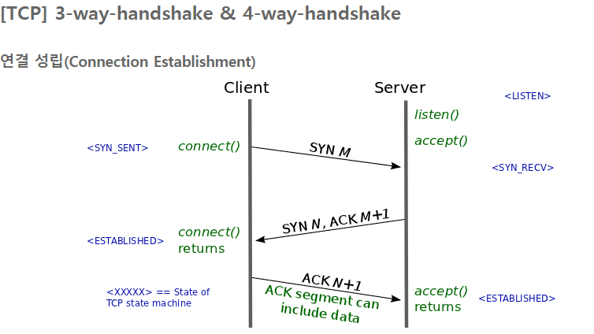
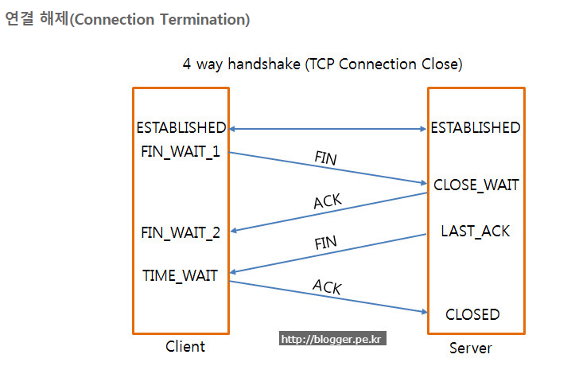
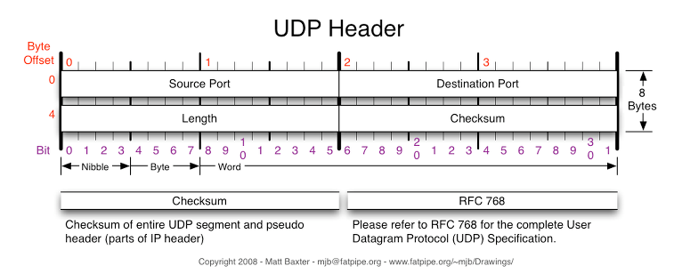
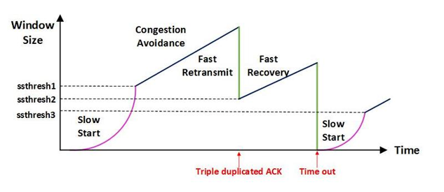

# Part 1-3 Network

- [HTTP 의 GET 과 POST 비교](#http의-get과-post-비교)
- [TCP 3-way-handshake](#tcp-3-way-handshake)
- [TCP 4-way-handshake](#tcp-4-way-handshake)
- [TCP와 UDP의 비교](#tcp와-udp의-비교)
  - TCP의 흐름제어
  - TCP의 혼잡제어
- [OSI 7계층](#osi-7계층)
- [HTTP 와 HTTPS](#http와-https)
  - HTTP 의 문제점들
  - HTTPS의 동작원리
- [DNS Round Robin 방식](#dns-round-robin-방식)
- [웹 통신의 큰 흐름](#웹-통신의-큰-흐름)
- [쿠키와 세션](#쿠키와-세션)

[뒤로](https://github.com/pjok1122/Interview_Question_for_Beginner)

 

## HTTP의 GET과 POST 비교

둘 다 HTTP 프로토콜을 이용해서 서버에 무엇인가를 요청할 때 사용하는 방식이다. 하지만 둘의 특징을 제대로 이해하여 기술의 목적에 맞게 알맞은 용도에 사용해야한다.

### GET

우선 GET 방식은 요청하는 데이터가 `HTTP Request Message`의 Header 부분의 url 에 담겨서 전송된다. 때문에 url 상에 `?` 뒤에 데이터가 붙어 request 를 보내게 되는 것이다. 이러한 방식은 url 이라는 공간에 담겨가기 때문에 전송할 수 있는 데이터의 크기가 제한적이다. 또 보안이 필요한 데이터에 대해서는 데이터가 그대로 url 에 노출되므로 `GET`방식은 적절하지 않다. (ex. password)

### POST

POST 방식의 request 는 `HTTP Message의 Body` 부분에 데이터가 담겨서 전송된다. 때문에 바이너리 데이터를 요청하는 경우 POST 방식으로 보내야 하는 것처럼 데이터 크기가 GET 방식보다 크고 보안면에서 낫다.(하지만 보안적인 측면에서는 암호화를 하지 않는 이상 고만고만하다.)

_그렇다면 이러한 특성을 이해한 뒤에는 어디에 적용되는지를 알아봐야 그 차이를 극명하게 이해할 수 있다._  
우선 GET 은 가져오는 것이다. 서버에서 어떤 데이터를 가져와서 보여준다거나 하는 용도이지 서버의 값이나 상태 등을 변경하지 않는다. SELECT 적인 성향을 갖고 있다고 볼 수 있는 것이다. 반면에 POST 는 서버의 값이나 상태를 변경하기 위해서 또는 추가하기 위해서 사용된다.

부수적인 차이점을 좀 더 살펴보자면 GET 방식의 요청은 브라우저에서 Caching 할 수 있다. 때문에 POST 방식으로 요청해야 할 것을 보내는 데이터의 크기가 작고 보안적인 문제가 없다는 이유로 GET 방식으로 요청한다면 기존에 caching 되었던 데이터가 응답될 가능성이 존재한다. 때문에 목적에 맞는 기술을 사용해야 하는 것이다.

[뒤로](https://github.com/pjok1122/Interview_Question_for_Beginner)
/[위로](#part-1-3-network)

 

## TCP 3-way-handshake

1. 클라이언트는 서버에게 SYN(m) 패킷을 전송한다.
2. 서버는 클라이언트의 요청에 대한 응답 ACK(m+1)과 자신의 요청 SYN(n)을 전송한다.
3. 클라이언트는 서버의 요청에 대한 응답 ACK(n+1)을 전송하고 연결이 성립된다.

 

## TCP 4-way-handshake

1. 클라이언트는 서버에게 접속 종료 요청인 FIN 플래그를 전송하고 `FIN_WAIT1` 상태가 된다.
2. 서버는 클라이언트의 요청에 대한 응답 ACK를 전송하고 `CLOSE_WAIT` 상태가 된다.(클라이언트는 `FIN_WAIT2`) CLOSE_WAIT 상태에서 클라이언트에게 보내지 못한 데이터를 전부 전송한다.
3. 보내지 못한 데이터를 전부 전송했다면, 클라이언트에게 FIN 플래그를 전송한다. 이때 서버는 `LAST ACK` 상태가 된다.
4. 클라이언트는 서버에게 ACK 메시지를 보내고 `TIME_WAIT` 상태에 들어간다. `TIME_WAIT` 상태는 아직 못 받은 데이터가 있을 수도 있으니 TCP 세션을 일정 시간동안 열어두는 상태를 말한다.

### SYN과 ACK의 의미

- SYN : SYnchronize sequence Number
- ACK : Acknowlegement

SYN은 자신이 보내는 패킷의 번호를 의미하고, ACK는 그 패킷을 잘 받았다는 목적으로 사용한다. TCP 헤더 부분에는 Flag 라는 6bit의 필드가 존재하고 각각의 bit는 Urg-ACK-Psh-Rst-Syn-Fin를 의미한다.

### SYN과 ACK가 꼭 둘다 필요한가?

SYN 하나로만 통신한다면, 응답에 대한 메시지를 받지 못하게 된다. 이런저런 방법을 고안해봐도 TCP의 전이중 방식과 신뢰성을 보장받기는 힘들다.

### 꼭 3번의 악수가 필요한가? 2번으로는 안되는가?

두 번의 악수만으로는 전이중 방식을 만족하지 못한다. 클라이언트가 `잘 들리세요~?` 라는 질문에 서버가 `잘 들립니다. 잘 들리시나요~?` 라고 응답했다고 하자. 여기에 대한 클라이언트의 대답이 돌아오지 않는 상황이 2-way handshake이다. 단방향 통신이라면 클라이언트는 서버에게 일방적으로 메시지를 전송할 수 있지만, TCP는 전이중이므로 2way로는 불가능하다.

### 왜 sequence number를 랜덤하게 설정하는가?

sequence number를 난수로 사용하는 이유는, 이전의 connection에서 전송한 패킷과 새로 연결된 connection에 대한 패킷을 구분하기 위해서 이다.

#### Reference

- http://asfirstalways.tistory.com/356

[뒤로](https://github.com/pjok1122/Interview_Question_for_Beginner)
/[위로](#part-1-3-network)

 

## TCP와 UDP의 비교

### UDP

`UDP(User Datagram Protocol)`는 비연결형 프로토콜입니다. UDP는 흐름제어, 오류제어, 재전송 기능을 제공하지 않습니다. 따라서 TCP보다 데이터가 작아 오버헤드가 적습니다. UDP는 `동영상 스트리밍`, `DNS` 등에서 사용됩니다.

IP는 host to host 간의 연결은 가능하지만, host 내에 어떤 프로그램과 통신할지 구분할 수 없다는 한계가 있습니다. 이를 개선하기 위해 UDP가 개발되었습니다. (패킷의 순서가 바뀌거나 누락될 수 있는데, 어플리케이션 단에서 처리해야 합니다.)

 

### TCP

TCP(Transmission Control Protocol)은 `신뢰성있는 데이터 전송`을 위해 개발되었습니다. TCP의 연결 설정은 3 way handshaking을 통해 이루어집니다. 모든 TCP의 연결은 전이중 방식이며, 1:1 통신입니다. 따라서 TCP는 멀티캐스팅이나 브로드캐스팅을 지원하지 않습니다.

### TCP의 흐름제어

흐름제어는 송신속도와 수신속도의 차이를 조절하기 위해 사용되는 기법입니다.

- STOP AND WAIT : 하나의 패킷을 보내고 ACK가 돌아올 때까지 메시지를 전송하지 않고 기다리는 방법입니다.

- SLIDING WINDOW : 수신측에서 설정한 크기만큼은 ACK를 받지 않아도 세그먼트를 한 번에 전송할 수 있습니다. ACK 메시지를 받게 되면, 받은 만큼 window를 옆으로 sliding 하여 받은 만큼 메시지를 전송할 수 있습니다.

`SLIDING WINDOW`에는 크게 두 가지 프로토콜이 있습니다.

- GBN(Go Back-N) 프로토콜 : Sliding window만큼 전송하되, 손실된 패킷이 있을 경우 손실된 패킷부터 전부 재전송합니다.

- SR(Selective Repeat) : Sliding window만큼 전송하고, 손실된 패킷이 있는 경우 손실된 패킷만 재전송합니다. 수신측은 순서가 일치하지 않는 패킷도 저장소에 저장해둡니다.

GBN은 비용이 저렴하지만 네트워크 트래픽을 해칠 수 있습니다. SR은 누락된 패킷 번호 이후의 잘 받은 패킷들을 임시 저장할 공간이 필요하므로 비용이 많이 듭니다.

### TCP의 혼잡제어

혼잡제어는 네트워크가 혼잡할 때, 라우터의 오버플로우로 패킷이 손실되는 상황을 막기 위해 사용됩니다.

1. AIMD(합증가, 곱감소) : 초기 윈도우 사이즈를 1로 설정하고, ACK를 수신할 때마다 윈도우 사이즈를 1씩 증가 시킵니다. 만약 패킷이 누락된다면 윈도우 사이즈를 절반으로 줄입니다. 이 방법은 초기에 높은 대역폭을 사용하지 못하며 혼잡상태에 도달하고 나서야 대처한다는 단점이 있습니다.

2. Slow Start : 초기 윈도우 사이즈를 1로 설정하고, 각 ACK마다 윈도우 사이즈를 1씩 증가시키기 때문에, 한 사이클에 윈도우 사이즈가 2배씩 늘어납니다. 임계치를 넘어서면 혼잡회피 단계에 접어들고, AIMD 방식으로 동작합니다.

3. Fast Retransmit(빠른 재전송) : 동일한 ACK 메시지를 3번 받았을 때, 해당 메시지를 재전송하고, 윈도우 사이즈를 절반으로 줄입니다.

4. Fast Recovery(빠른 회복) : 혼잡 상태가 발생하여도 윈도우 사이즈를 절반으로 줄인 뒤 선형증가하도록 만듭니다. 한 번 더 혼잡상태가 발생하면 임계치를 현재 윈도우의 절반으로 줄이고, 윈도우 사이즈를 1로 줄입니다.

_동일한 ACK를 3번 받았다는 것은, 패킷이 일부 누락되었다는 의미로 약한 혼잡 상태로 볼 수 있습니다._

#### Reference

- http://d2.naver.com/helloworld/47667
- http://asfirstalways.tistory.com/327

[뒤로](https://github.com/pjok1122/Interview_Question_for_Beginner)/[위로](#part-1-3-network)

 

## OSI 7계층

네트워크를 7개의 계층으로 나누고 모듈화하여 관리하는 것을 의미합니다.

#### 물리계층

- 케이블/리피터/허브

데이터를 전기적 신호로 전송하는 역할을 합니다.

#### 데이터 링크 계층

- 스위치/브릿지

물리계층으로 송수신되는 정보들을 관리합니다. 송수신 하기 위해 프레임에 MAC주소를 부여하고 에러검출, 재전송, 흐름제어를 진행합니다.

#### 네트워크 계층

- IP/라우터

다른 장소에 위치한 두 시스템 간의 연결성과 경로 선택을 제공한다.

#### 전송 계층

- TCP/UDP

데이터를 전송하는 역할을 담당한다. TCP : 신뢰성, 연결지향적

#### 세션 계층

- Socket

데이터가 통신하기 위한 논리적인 연결을 담당한다. TCP/IP 세션을 만들고 닫는 역할을 한다.

#### 표현 계층

- JEPG/MPEG

데이터 표현에 대한 독립성을 제공하고, 파일을 인코딩, 암호화, 압축하는 역할을 담당합니다.

#### 어플리케이션 계층

- HTTP/DNS/FTP 등

실제 서비스를 제공하는 계층을 의미합니다. 전자우편, 데이터베이스 관리 등..

[뒤로](https://github.com/pjok1122/Interview_Question_for_Beginner)/[위로](#part-1-3-network)

 

## HTTP와 HTTPS

### HTTP 의 문제점

- HTTP 는 평문 통신이기 때문에 `도청`이 가능하다.
- 통신 상대를 확인하지 않기 때문에 `위장`이 가능하다.
- 완전성을 증명할 수 없기 때문에 `변조`가 가능하다.

_위 세 가지는 다른 암호화하지 않은 프로토콜에도 공통되는 문제점들이다._

### TCP/IP 는 도청 가능한 네트워크이다.

TCP/IP 구조의 통신은 전부 통신 경로 상에서 엿볼 수 있다. 패킷을 수집하는 것만으로 도청할 수 있다. 평문으로 통신을 할 경우 메시지의 의미를 파악할 수 있기 때문에 암호화하여 통신해야 한다.

#### 보안 방법

1.  통신 자체를 암호화  
    `SSL(Secure Socket Layer)` or `TLS(Transport Layer Security)`라는 다른 프로토콜을 조합함으로써 HTTP 의 통신 내용을 암호화할 수 있다. SSL 을 조합한 HTTP 를 `HTTPS(HTTP Secure)` or `HTTP over SSL`이라고 부른다.

2.  콘텐츠를 암호화  
    말 그대로 HTTP 를 사용해서 운반하는 내용인, `HTTP 메시지에 포함되는 콘텐츠만 암호화`하는 것이다. 암호화해서 전송하면 받은 측에서는 그 암호를 해독하여 출력하는 처리가 필요하다.

 

### 통신 상대를 확인하지 않기 때문에 위장이 가능하다.

HTTP 에 의한 통신에는 상대가 누구인지 확인하는 처리는 없기 때문에 누구든지 리퀘스트를 보낼 수 있다. IP 주소나 포트 등에서 그 웹 서버에 액세스 제한이 없는 경우 리퀘스트가 오면 상대가 누구든지 무언가의 리스폰스를 반환한다. 이러한 특징은 여러 문제점을 유발한다.

1.  리퀘스트를 보낸 곳의 웹 서버가 원래 의도한 리스폰스를 보내야 하는 웹 서버인지를 확인할 수 없다.
2.  리스폰스를 반환한 곳의 클라이언트가 원래 의도한 리퀘스트를 보낸 클라이언트인지를 확인할 수 없다.
3.  통신하고 있는 상대가 접근이 허가된 상대인지를 확인할 수 없다.
4.  어디의에서 누가 리퀘스트 했는지 확인할 수 없다.
5.  **의미없는 리퀘스트도 수신한다. —> DoS 공격을 방지할 수 없다.**

#### 보완 방법

위 암호화 방법으로 언급된 `SSL`로 상대를 확인할 수 있다. SSL 은 상대를 확인하는 수단으로 **증명서** 를 제공하고 있다. 증명서는 신뢰할 수 있는 **제 3 자 기관에 의해** 발행되는 것이기 때문에 서버나 클라이언트가 실재하는 사실을 증명한다. 이 증명서를 이용함으로써 통신 상대가 내가 통신하고자 하는 서버임을 나타내고 이용자는 개인 정보 누설 등의 위험성이 줄어들게 된다. 한 가지 이점을 더 꼽자면 클라이언트는 이 증명서로 본인 확인을 하고 웹 사이트 인증에서도 이용할 수 있다.

 

### 완전성을 증명할 수 없기 때문에 변조가 가능하다

여기서 완전성이란 **정보의 정확성** 을 의미한다. 서버 또는 클라이언트에서 수신한 내용이 송신측에서 보낸 내용과 일치한다라는 것을 보장할 수 없는 것이다. 리퀘스트나 리스폰스가 발신된 후에 상대가 수신하는 사이에 누군가에 의해 변조되더라도 이 사실을 알 수 없다. 이와 같이 공격자가 도중에 리퀘스트나 리스폰스를 빼앗아 변조하는 공격을 **중간자 공격(Man-in-the-Middle)**이라고 부른다.

#### 보완 방법

`MD5`, `SHA-1` 등의 해시 값을 확인하는 방법과 파일의 디지털 서명을 확인하는 방법이 존재하지만 확실히 확인할 수 있는 것은 아니다. 확실히 방지하기에는 `HTTPS`를 사용해야 한다. SSL 에는 인증이나 암호화, 그리고 다이제스트 기능을 제공하고 있다.

 

### HTTPS

> HTTP 에 암호화와 인증, 그리고 완전성 보호를 더한 HTTPS

`HTTPS`는 SSL 의 껍질을 덮어쓴 HTTP 라고 할 수 있다. 즉, HTTPS 는 새로운 애플리케이션 계층의 프로토콜이 아니라는 것이다. HTTP 통신하는 소켓 부분을 `SSL(Secure Socket Layer)` or `TLS(Transport Layer Security)`라는 프로토콜로 대체하는 것 뿐이다. HTTP 는 원래 TCP 와 직접 통신했지만, HTTPS 에서 HTTP 는 SSL 과 통신하고 **SSL 이 TCP 와 통신** 하게 된다. SSL 을 사용한 HTTPS 는 암호화와 증명서, 안전성 보호를 이용할 수 있게 된다.

HTTPS 의 SSL 에서는 공통키 암호화 방식과 공개키 암호화 방식을 혼합한 하이브리드 암호 시스템을 사용한다. 공통키를 공개키 암호화 방식으로 교환한 다음에 다음부터의 통신은 공통키 암호를 사용하는 방식이다.

#### 동작 방법

1. 웹 서버는 자신의 공개키를 CA에 돈을 주고 맡깁니다.
2. CA는 ‘서버의 공개키’를 포함하는 인증서를 만들고, 자신의 개인키로 암호화하여 웹 서버에 돌려줍니다.
3. 웹 서버는 클라이언트의 요청이 들어왔을 때, ‘CA의 개인키’로 암호화된 인증서를 전달합니다.
4. 클라이언트의 브라우저에는 신뢰할 수 있는 기관의 공개키가 저장되어있습니다. 해당하는 CA의 공개키를 찾아 인증서를 복호화하면, 웹 서버의 ‘공개키’를 얻을 수 있습니다.
5. 클라이언트는 대칭키를 생성할 수 있는 난수를 ‘웹 서버의 공개키’로 암호화하여 전송합니다.
6. 서버와 클라이언트는 각자 난수를 가지고 대칭키를 생성합니다.

#### 모든 웹 페이지에서 HTTPS 를 사용하지 않는 이유

모든 데이터를 암호화하면 리소스의 낭비가 심하기 때문에, 민감한 정보에 대해서만 암호화를 진행합니다.

_cf) HTTP 2.0 이 발전되면서 HTTPS 가 HTTP 보다 빠르다는 사실이 나왔는데요, 다음 링크를 통해 보다 자세한 내용을 확인하실 수 있습니다._  
관련 링크 : [HTTPS 가 HTTP 보다 빠르다.](https://tech.ssut.me/https-is-faster-than-http/)

[뒤로](https://github.com/pjok1122/Interview_Question_for_Beginner)/[위로](#part-1-3-network)

 

## DNS round robin 방식

DNS에 IP를 질의할 때, 웹 서버의 IP를 번갈아가며 가르쳐주는 방식입니다. 예를 들어 www.abc.com 에 대한 DNS 질의를 하면, 128.1.1.1 과 128.1.1.2를 번갈아가며 알려주게 됩니다.

### DNS Round Robin 방식의 문제점

1.  서버의 수 만큼 공인 IP 주소가 필요함  
    부하 분산을 위해 서버의 대수를 늘리기 위해서는 그 만큼의 공인 IP 가 필요하다.

2.  균등하게 분산되지 않음 (caching 때문)
    모바일 사이트 등에서 문제가 될 수 있는데, 스마트폰의 접속은 캐리어 게이트웨이 라고 하는 프록시 서버를 경유 한다. 프록시 서버에서는 이름변환 결과가 일정 시간 동안 캐싱되므로 같은 프록시 서버를 경유 하는 접속은 항상 같은 서버로 접속된다. 또한 PC 용 웹 브라우저도 DNS 질의 결과를 캐싱하기 때문에 균등하게 부하분산 되지 않는다. DNS 레코드의 TTL 값을 짧게 설정함으로써 어느 정도 해소가 되지만, TTL 에 따라 캐시를 해제하는 것은 아니므로 반드시 주의가 필요하다.

3.  서버가 다운돼도 확인 불가  
    DNS 서버는 웹 서버의 부하나 접속 수 등의 상황에 따라 질의결과를 제어할 수 없다. 웹 서버의 부하가 높아서 응답이 느려지거나 접속수가 꽉 차서 접속을 처리할 수 없는 상황인 지를 전혀 감지할 수가 없기 때문에 어떤 원인으로 다운되더라도 이를 검출하지 못하고 유저들에게 제공한다. 이때문에 유저들은 간혹 다운된 서버로 연결이 되기도 한다. DNS 라운드 로빈은 어디까지나 부하분산 을 위한 방법이지 다중화 방법은 아니므로 다른 S/W 와 조합해서 관리할 필요가 있다.

_Round Robin 방식을 기반으로 단점을 해소하는 DNS 스케줄링 알고리즘이 존재한다. (일부만 소개)_

#### weighted round-robin

각각의 웹 서버에 가중치를 가미해서 분산 비율을 변경한다. 물론 가중치가 큰 서버일수록 빈번하게 선택되므로 처리능력이 높은 서버는 가중치를 높게 설정하는 것이 좋다.

#### least-connection

접속 클라이언트 수가 가장 적은 서버를 선택한다. 로드밸런서에서 실시간으로 connection 수를 관리하거나 각 서버에서 주기적으로 알려주는 것이 필요하다.

[뒤로](https://github.com/pjok1122/Interview_Question_for_Beginner)/[위로](#part-1-3-network)

 

## 웹 통신의 큰 흐름

_우리가 Chrome 을 실행시켜 주소창에 특정 URL 값을 입력시키면 어떤 일이 일어나는가?_

### in 브라우저

1.  url 에 입력된 값을 브라우저 내부에서 결정된 규칙에 따라 그 의미를 조사한다.
2.  조사된 의미에 따라 HTTP Request 메시지를 만든다.
3.  만들어진 메시지를 프로토콜 스택으로 넘겨준다.

이 때 만들어진 메시지 전송은 브라우저가 직접하는 것이 아니다. 브라우저는 메시지를 네트워크에 송출하는 기능이 없으므로 OS에 의뢰하여 메시지를 전달한다. 우리가 택배를 보낼 때 직접 보내는게 아니라, 이미 서비스가 이루어지고 있는 택배 시스템(택배 회사)을 이용하여 보내는 것과 같은 이치이다. 단, OS에 송신을 의뢰할 때는 도메인명이 아니라 ip주소로 메시지를 받을 상대를 지정해야 하는데, 이 과정에서 DNS서버를 조회해야 한다.

 

### in 프로토콜 스택, LAN 어댑터

1.  프로토콜 스택(운영체제에 내장된 네트워크 제어용 소프트웨어)이 브라우저로부터 메시지를 받는다.
2.  브라우저로부터 받은 메시지를 패킷 속에 저장한다.
3.  그리고 수신처 주소 등의 제어정보를 덧붙인다.
4.  그런 다음, 패킷을 LAN 어댑터에 넘긴다.
5.  LAN 어댑터는 ip주소를 MAC주소로 변환하여 케이블로 송출한다.

프로토콜 스택은 통신 중 오류가 발생했을 때, 이 제어 정보를 사용하여 고쳐 보내거나, 각종 상황을 조절하는 등 다양한 역할을 하게 된다. 네트워크 세계에서는 비서가 있어서 우리가 비서에게 물건만 건네주면, 받는 사람의 주소와 각종 유의사항을 써준다! 여기서는 프로토콜 스택이 비서의 역할을 한다고 볼 수 있다.

 

### in 허브, 스위치, 라우터

1.  LAN 어댑터가 송신한 패킷은 스위칭 허브를 경우하여 인터넷 접속용 라우터에 도착한다.
2.  라우터는 패킷을 프로바이더(통신사)에게 전달한다.
3.  인터넷으로 들어가게 된다.

 

### in 액세스 회선, 프로바이더

1.  패킷은 인터넷의 입구에 있는 액세스 회선(통신 회선)에 의해 POP(Point Of Presence, 통신사용 라우터)까지 운반된다.
2.  POP 를 거쳐 인터넷의 핵심부로 들어가게 된다.
3.  수 많은 고속 라우터들 사이로 패킷이 목적지를 향해 흘러가게 된다.

 

### in 방화벽, 캐시서버

1.  패킷은 인터넷 핵심부를 통과하여 웹 서버측의 LAN 에 도착한다.
2.  기다리고 있던 방화벽이 도착한 패킷을 검사한다.
3.  패킷이 웹 서버까지 가야하는지 가지 않아도 되는지를 판단하는 캐시서버가 존재한다.

굳이 서버까지 가지 않아도 되는 경우를 골라낸다. 액세스한 페이지의 데이터가 캐시서버에 있으면 웹 서버에 의뢰하지 않고 바로 그 값을 읽을 수 있다. 페이지의 데이터 중에 다시 이용할 수 있는 것이 있으면 캐시 서버에 저장된다.

 

### in 웹 서버

1.  패킷이 물리적인 웹 서버에 도착하면 웹 서버의 프로토콜 스택은 패킷을 추출하여 메시지를 복원하고 웹 서버 애플리케이션에 넘긴다.
2.  메시지를 받은 웹 서버 애플리케이션은 요청 메시지에 따른 데이터를 응답 메시지에 넣어 클라이언트로 회송한다.
3.  왔던 방식대로 응답 메시지가 클라이언트에게 전달된다.

 

#### Personal Recommendation

- (도서) [성공과 실패를 결정하는 1% 네트워크 원리](http://www.yes24.com/24/Goods/17286237?Acode=101)
- (도서) [그림으로 배우는 Http&Network basic](http://www.yes24.com/24/Goods/15894097?Acode=101)
- (도서) [HTTP 완벽 가이드](http://www.yes24.com/24/Goods/15381085?Acode=101)
- Socket programming (Multi-chatting program)

[뒤로](https://github.com/pjok1122/Interview_Question_for_Beginner)/[위로](#part-1-3-network)

 

---

## 쿠키와 세션

### 쿠키

> 쿠키는 클라이언트의 정보를 저장해두었다가 서버에게 전달해, 이전의 정보를 유지하는 용도로 사용할 수 있다. (ex : 장바구니, 선호 언어 등)

### 세션

> 쿠키는 쉽게 탈취될 수 있다는 단점을 보완해, 서버에 클라이언트의 정보를 저장해두고, 클라이언트는 session id를 통해 서버에게 자신을 식별시킬 수 있다.

### 쿠키와 세션의 차이

##### 저장 위치

- 쿠키 : 클라이언트의 웹 브라우저가 지정하는 메모리나 디스크
- 세션 : 서버의 메모리

##### 만료 시점

- 쿠키 : expires 라는 속성을 정의해 삭제될 날짜를 지정할 수 있다.
- 세션 : 클라이언트가 로그아웃하거나, 설정 시간동안 반응이 없으면 만료되나, 명확한 시점을 알 수가 없다.

##### 리소스

- 쿠키 : 클라이언트의 메모리를 사용하기 때문에 서버 자원을 사용하지 않는다.
- 세션 : 세션은 서버에 저장되고, 서버 메모리로 로딩되기 때문에 세션이 생길 때마다 리소스를 차지하게 된다.

##### 용량 제한

- 쿠키 : 쿠키는 서버에서 발행해, 클라이언트가 저장하는 것이기 때문에 제한이 없다면 쿠키로 인한 메모리 공격이 가능하다. 따라서 쿠키는 도메인 당 20개, 하나의 쿠키 당 4KB라는 제한이 있다.

- 세션 : 개수나 용량에 대한 제한이 없다.

 

[뒤로](https://github.com/pjok1122/Interview_Question_for_Beginner)/[위로](#part-1-3-network)

 

---

## OAuth

> 타 사이트에 가입된 사용자가 허락한다면, 타사이트에서 제공하는 서비스를 우리의 웹 서비스에서 사용할 수 있도록 도와주는 프레임워크이다.

### 용어 설명

- Resource Owner : 타사이트에 가입된 유저 (구글에 가입된 유저)
- Client : OAuth를 이용해 타사의 서비스를 이용하려고 하는 웹사이트 (ex: 우리의 웹 서비스)
- Resource Server : Resource Owner의 서비스를 제공하는 사이트 (ex: 구글)

### Access Token

> 사용자가 타 사이트가 제공하는 서비스에 대한 권한을 넘겨주면, 우리의 웹 서비스는 Access Token을 이용해 타 사이트의 서비스를 이용할 수 있다.

#### Access Token 발급과정

[발급 과정 설명](https://blog.naver.com/pjok1122/221584346870) 

_Network.end_
