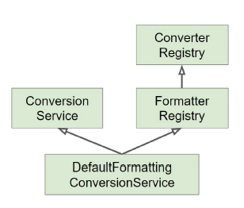

# Validation & Databinding 추상화

- [Validation &amp; Databinding 추상화](#validation-amp-databinding-%ec%b6%94%ec%83%81%ed%99%94)
	- [Validator](#validator)
		- [인터페이스](#%ec%9d%b8%ed%84%b0%ed%8e%98%ec%9d%b4%ec%8a%a4)
		- [스프링 부트 2.0.5 이상 버전](#%ec%8a%a4%ed%94%84%eb%a7%81-%eb%b6%80%ed%8a%b8-205-%ec%9d%b4%ec%83%81-%eb%b2%84%ec%a0%84)
	- [DataBinding](#databinding)
		- [PropertyEditor](#propertyeditor)
		- [Converter](#converter)
		- [Formatter](#formatter)
			- [Registry 등록](#registry-%eb%93%b1%eb%a1%9d)
		- [ConversionService](#conversionservice)

## Validator

[org.springwork.validation.Validator](https://docs.spring.io/spring/docs/current/javadoc-api/org/springframework/validation/Validator.html)

애플리케이션에서 사용하는 객체 검증용 인터페이스다. 스프링 MVC에서 주로 사용되지만, 사실 어떠한 계층과도 상관없이 사용할 수 있다. 웹 서비스, 데이터 등 어느 계층에서나 사용 가능하다. Validator의 구현체로는 `LocalValidatorFactoryBean`이 있다.

### 인터페이스

- boolean supports(Class clazz) : 어떤 타입의 객체를 검증할 때 사용할 것인지를 결정한다.
- void validate(Object obj, Errors e) : 실제 검증 로직을 이 안에서 구현하며, 에러 발생 시 e에 에러를 주입한다.
  - 구현할 때 ValidationUtils를 사용하면 편리하나, 오래된 방법.

### 스프링 부트 2.0.5 이상 버전

- LocalValidatorFactoryBean이 빈으로 자동 등록되어있다.
- @Email, @NotNull, @Min, @Max, @Size 등으로 편하게 검증이 가능하다.
- 비즈니스 로직에서 검증해야 하는 경우, validate를 직접 정의하여 사용한다.
- https://beanvalidation.org/

```java
public class Event {
	@NotNull
	String title;
    ...
}
```

```java
@Autowired
Validator validator;
public void run(ApplicationArguments args) throws Exception {
    System.out.println(validator.getClass());

    Event event = new Event();
    Errors errors = new BeanPropertyBindingResult(event, "event"); //사실 이렇게는 거의 사용 안함.
    validator.validate(event, errors);
```

<hr>

## DataBinding

[org.springframework.validation.DataBinder](https://docs.spring.io/spring/docs/current/javadoc-api/org/springframework/validation/DataBinder.html)

- 기술적인 관점 : 프로퍼티 값을 타겟 객체에 설정하는 기능
- 사용자 관점 : 사용자 입력값을 애플리케이션 도메인 모델에 동적으로 변환해 넣어주는 기능. 즉, 입력값은 항상 "문자열"인데, 그 값을 객체가 가지고 있는 타입(int, long, boolean, Data, `Event`, `Book`)으로 변환해 넣어주는 기능을 제공한다.

### PropertyEditor

- 스프링 3.0 이전까지 DataBinder가 변환 작업에 사용하던 인터페이스 (오래된 버전)
- Thread-safe 하지 않기 때문에 **절대 싱글톤으로 생성해서는 안된다.** (상태 정보가 저장되어있음.)
- Object와 String 간의 변환만 할 수 있어, 사용 범위가 제한적이다.

```java
public class EventEditor extends PropertyEditorSupport {
	@Override
	public String getAsText() {
		Event event = (Event) getValue();
		return event.getId().toString();
	}
	@Override
	public void setAsText(String text) throws IllegalArgumentException {
		setValue(new Event(Integer.parseInt(text)));
	}
}
```

```java
@RestController
public class EventController {

	@InitBinder
	public void init(WebDataBinder webDataBinder) {
		webDataBinder.registerCustomEditor(Event.class, new EventEditor());
	}
```

PropertyEditor는 인터페이스로 구현해야 할 메서드가 많이 있다. 따라서 PropertyEditorSupport를 상속받아, 두 가지 기능만 오버라이딩 한다.

@InitBinder를 통해 사용할 PropertyEditor를 등록한다.

**오래된 방법이므로 사용하지 않음. 원리만 기억하자.**

### Converter

- `Source` Type을 `Target` Type으로 변환할 수 있는 일반적인 변환기.
- `PropertyEditor`와 다르게 상태정보를 저장하지 않으므로 `Thread-safe` 하다. (빈으로 등록이 가능하다.)
- `ConverterRegistry`에 등록해서 사용한다.

```java
public class EventConverter {

	public static class StringToEventConverter implements Converter<String, Event>{
		@Override
		public Event convert(String source) {
			return new Event(Integer.parseInt(source));
		}
	}

	public static class EventToStringConverter implements Converter<Event, String>{
		@Override
		public String convert(Event source) {
			return source.getId().toString();
		}
	}
}
```

### Formatter

- PropertyEditor의 대체제라고 볼 수 있다.
- Converter를 상속받아 구현되었다.
- Object와 String 간의 변환을 담당한다.
- **문자열을 Locale에 따라 다국화 하는 기능도 제공한다.**
- `FormatterRegistry`에 등록해서 사용한다.

```java
@Component
public class EventFormatter implements Formatter<Event> {

	@Override
	public Event parse(String text, Locale locale) throws ParseException {
		return new Event(Integer.parseInt(text));
	}

	@Override
	public String print(Event object, Locale locale) {
		return object.getId().toString();
	}
}
```

빈으로 등록이 가능하기 때문에 `MessageSource`를 주입받아, 다국화 기능을 사용할 수 있다.

스프링부트에서는 Formatter와 Converter 빈을 찾아 자동으로 registry에 등록해준다. 만약 스프링부트가 아니라면 다음처럼 직접 Config 파일을 만들어 등록할 수 있다.

#### Registry 등록

```java
@Configuration
public class WebConfig implements WebMvcConfigurer {

    //컨버터 등록
    @Override
    public void addFormatters(FormatterRegistry registry){
        registry.addConverter(new EventConverter.StringToEventConverter());
    }

    //포매터 등록
    @Override
    public void addFormatters(FormatterRegistry registry){
        registry.addFormatter(new EventFormatter());
    }
}
```

### ConversionService



스프링 3.0 이전에는 `DataBinder`가 `PropertyEditor`을 이용해서 데이터 형변환을 제공했다. Converter의 경우에는 ConversionService 라는 인터페이스를 통해서 `Thread-safe`하게 변환 작업을 수행한다. 주로 스프링 MVC, 빈(value) 설정, SpEL에서 사용한다.

ConversionService의 대표적인 구현체는 `DefaultFormattingConversionService`인데, 여러 기본 컨버터와 포매터를 가지고 있다.

스프링부트에서는 웹 어플리케이션인 경우에 DefaultFormattingConversionService를 상속하여 만든 `WebConversionService`를 빈으로 등록해준다. `WebConversionService`는 Formatter와 Conversion 빈을 찾아 자동으로 Registry에 등록해준다.
